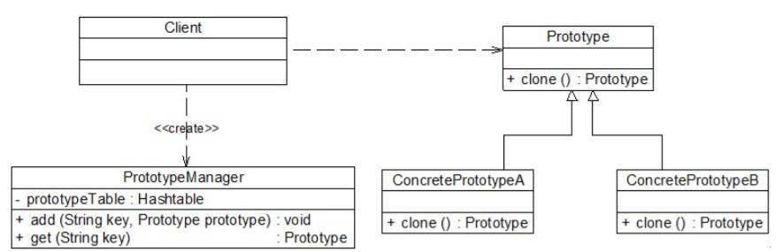

# 原型管理器
原型管理器(Prototype Manager)将多个原型对象存储在一个集合中供客户端使用，它是一个专门负责克隆对象的工厂，其中定义了一个集合用于存储原型对象，如果需要某个原型对象的一个克隆，可以通过复制集合中对应的原型对象来获得。在原型管理器中针对抽象原型类进行编程，以便扩展。

```
public class PrototypeManager{
    private Hashtable prototypeTable = new Hashtable();//使用Hashtable存储原型对象
    public PrototypeManager(){
        prototypeTable.put("A", new ConcretePrototypeA());
        prototypeTable.put("B", new ConcretePrototypeB());
    }

    public void add(String key, Prototype prototype){
        prototypeTable.put(key, prototype));
    }

    public Prototype get(String key){
        Prototype clone = null;
        clone = ((Prototype)prototypeTable.get(key)).clone(); //通过克隆方法创建新对象
        return clone;
    }
}
```