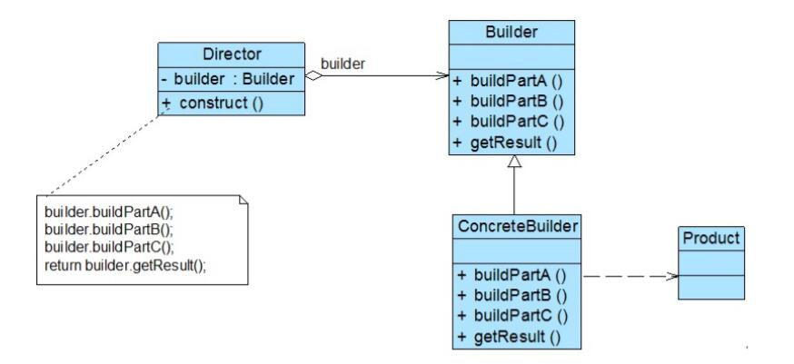

# 建造者模式结构与实现

## 建造者模式结构
1. Builder（抽象建造者）：它为创建一个产品Product对象的各个部件指定抽象接口，在该接口中一般声明两类方法，一类方法是buildPartX()，它们用于创建复杂对象的各个部件；另一类方法是getResult()，它们用于返回复杂对象。Builder既可以是抽象类，也可以是接口。
2. ConcreteBuilder（具体建造者）：它实现了Builder接口，实现各个部件的具体构造和装配方法，定义并明确它所创建的复杂对象，也可以提供一个方法返回创建好的复杂产品对象。
3. Product（产品角色）：它是被构建的复杂对象，包含多个组成部件，具体建造者创建该产品的内部表示并定义它的装配过程。
4. Director（指挥者）：指挥者又称为导演类，它负责安排复杂对象的建造次序，指挥者与抽象建造者之间存在关联关系，可以在其construct()建造方法中调用建造者对象的部件构造与装配方法，完成复杂对象的建造。客户端一般只需要与指挥者进行交互，在客户端确定具体建造者的类型，并实例化具体建造者对象（也可以通过配置文件和反射机制），然后通过指挥者类的构造函数或者Setter方法将该对象传入指挥者类中。



## 建造者模式实现
```
public class Product  {
       private  String partA; //定义部件，部件可以是任意类型，包括值类型和引用类型
       private  String partB;
       private  String partC;
       //partA的Getter方法和Setter方法省略
       //partB的Getter方法和Setter方法省略
       //partC的Getter方法和Setter方法省略
}
```
在抽象建造者类中定义了产品的创建方法和返回方法，其典型代码如下：
```
public abstract class Builder {
     //创建产品对象
       protected  Product product=new Product();

       public  abstract void buildPartA();
       public  abstract void buildPartB();
       public  abstract void buildPartC();

     //返回产品对象
       public  Product getResult() {
              return  product;
       }
}
```
在抽象类Builder中声明了一系列抽象的buildPartX()方法用于创建复杂产品的各个部件，具体建造过程在ConcreteBuilder中实现，此外还提供了工厂方法getResult()，用于返回一个建造好的完整产品。

在ConcreteBuilder中实现了buildPartX()方法，通过调用Product的setPartX()方法可以给产品对象的成员属性设值。不同的具体建造者在实现buildPartX()方法时将有所区别，如setPartX()方法的参数可能不一样，在有些具体建造者类中某些setPartX()方法无须实现（提供一个空实现）。而这些对于客户端来说都无须关心，客户端只需知道具体建造者类型即可。
```
public class ConcreteBuilder1 extends Builder{
    public void buildPartA(){
        product.setPart("A1");
    }

    public void buildPartB(){
        product.setPart("B1");
    }

    public void buildPartC(){
        product.setPart("C1");
    }
}
```
在建造者模式的结构中还引入了一个指挥者类Director，该类主要有两个作用：一方面它隔离了客户与创建过程；另一方面它控制产品的创建过程，包括某个buildPartX()方法是否被调用以及多个buildPartX()方法调用的先后次序等。指挥者针对抽象建造者编程，客户端只需要知道具体建造者的类型，即可通过指挥者类调用建造者的相关方法，返回一个完整的产品对象。
```
public class Director {
    private Builder builder;

    public Director(Builder builder) {
        this.builder=builder;
    }

    public void setBuilder(Builder builder) {
        this.builder=builer;
    }

    //产品构建与组装方法
    public Product construct() {
        builder.buildPartA();
        builder.buildPartB();
        builder.buildPartC();
        return builder.getResult();
    }
}
```
在指挥者类中可以注入一个抽象建造者类型的对象，其核心在于提供了一个建造方法construct()，在该方法中调用了builder对象的构造部件的方法，最后返回一个产品对象。

对于客户端而言，只需关心具体的建造者即可，一般情况下，客户端类代码片段如下所示：
```
……
Builder  builder = new ConcreteBuilder(); //可通过配置文件实现
Director director = new  Director(builder);
Product product = director.construct();
……
```
可以通过配置文件来存储具体建造者类ConcreteBuilder的类名，使得更换新的建造者时无须修改源代码，系统扩展更为方便。