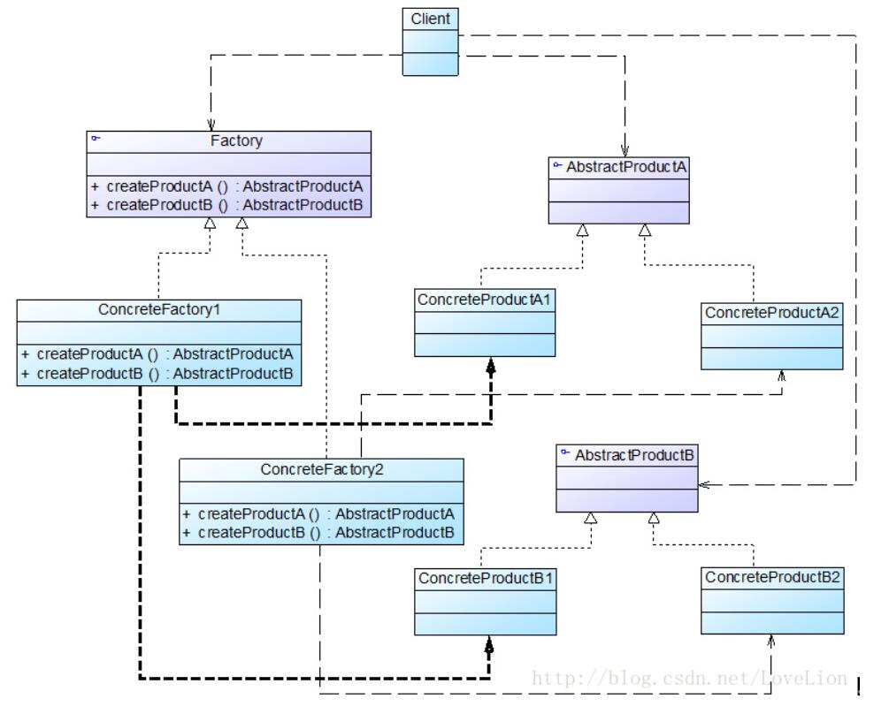

# 抽象工厂模式结构与实现

## 抽象工厂模式结构
* AbstractFactory（抽象工厂）：它声明了一组用于创建一族产品的方法，每一个方法对应一种产品。
* ConcreteFactory（具体工厂）：它实现了在抽象工厂中声明的创建产品的方法，生成一组具体产品，这些产品构成了一个产品族，每一个产品都位于某个产品等级结构中。
* AbstractProduct（抽象产品）：它为每种产品声明接口，在抽象产品中声明了产品所具有的业务方法。
* ConcreteProduct（具体产品）：它定义具体工厂生产的具体产品对象，实现抽象产品接口中声明的业务方法。



## 抽象工厂模式实现
在抽象工厂中声明了多个工厂方法，用于创建不同类型的产品，抽象工厂可以是接口，也可以是抽象类或者具体类，其典型代码如下所示：
```
public abstract class AbstractFactory {  
    public abstract AbstractProductA createProductA(); //工厂方法一  
    public abstract AbstractProductB createProductB(); //工厂方法二  
……  
}
```
具体工厂实现了抽象工厂，每一个具体的工厂方法可以返回一个特定的产品对象，而同一个具体工厂所创建的产品对象构成了一个产品族。对于每一个具体工厂类，其典型代码如下所示：
```
public class ConcreteFactory1 extends AbstractFactory {  
    //工厂方法一  
    public AbstractProductA createProductA() {  
        return new ConcreteProductA1();  
    }  

    //工厂方法二  
    public AbstractProductB createProductB() {  
        return new ConcreteProductB1();  
    }  

    ……  
}
```
与工厂方法模式一样，抽象工厂模式也可为每一种产品提供一组重载的工厂方法，以不同的方式对产品对象进行创建。