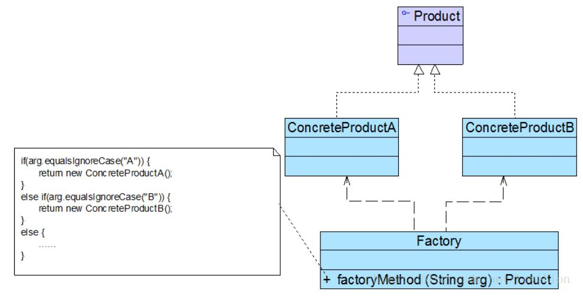

# 简单工厂模式结构与实现

## 简单工厂模式结构
简单工厂模式包含以下3个角色：
* Factory（工厂角色）：工厂角色即工厂类，它是简单工厂模式的核心，负责实现创建所有产品实例的内部逻辑；工厂类可以被外界直接调用，创建所需的产品对象；在工厂类中提供了静态的工厂方法factoryMethod()，它的返回类型为抽象产品类型Product。

* Product（抽象产品角色）：它是工厂类所创建的所有对象的父类，封装了各种产品对象的公有方法，它的引入将提高系统的灵活性，使得在工厂类中只需定义一个通用的工厂方法，因为所有创建的具体产品对象都是其子类对象。

* ConcreteProduct（具体产品角色）：它是简单工厂模式的创建目标，所有被创建的对象都充当这个角色的某个具体类的实例。每一个具体产品角色都继承了抽象产品角色，需要实现在抽象产品中声明的抽象方法。



## 简单工厂模式实现
在简单工厂模式中，客户端通过工厂类来创建一个产品类的实例，而无须直接使用new关键字来创建对象，它是工厂模式家族中最简单的一员。

在使用简单工厂模式时，首先需要对产品类进行重构，不能设计一个包罗万象的产品类，而需根据实际情况设计一个产品层次结构，将所有产品类公共的代码移至抽象产品类，并在抽象产品类中声明一些抽象方法，以供不同的具体产品类来实现，典型的抽象产品类代码如下所示：
```
public abstract class Product {  
    //所有产品类的公共业务方法  
    public void methodSame() {  
        //公共方法的实现  
    }  

    //声明抽象业务方法  
    public abstract void methodDiff();  
}
```
在具体产品类中实现了抽象产品类中声明的抽象业务方法，不同的具体产品类可以提供不同的实现。典型的具体产品类代码如下所示：
```
public class ConcreteProduct extends Product {  
    //实现业务方法  
    public void methodDiff() {  
        //业务方法的实现  
    }  
}
```
简单工厂模式的核心是工厂类，在没有工厂类之前，客户端一般会使用new关键字来直接创建产品对象，而在引入工厂类之后，客户端可以通过工厂类来创建产品，在简单工厂模式中，工厂类提供了一个静态工厂方法供客户端使用，根据所传入的参数不同可以创建不同的产品对象。典型的工厂类代码如下所示：
```
public class Factory {  
    //静态工厂方法  
    public static Product getProduct(String arg) {  
        Product product = null;  
        if (arg.equalsIgnoreCase("A")) {  
            product = new ConcreteProductA();  
            //初始化设置product  
        }  
        else if (arg.equalsIgnoreCase("B")) {  
            product = new ConcreteProductB();  
            //初始化设置product  
        }  
        return product;  
    }  
}
```
在客户端代码中，我们通过调用工厂类的工厂方法即可得到产品对象。典型代码如下所示：
```
public class Client {  
    public static void main(String args[]) {  
        Product product;   
        product = Factory.getProduct("A"); //通过工厂类创建产品对象  
        product.methodSame();  
        product.methodDiff();  
    }  
}
```