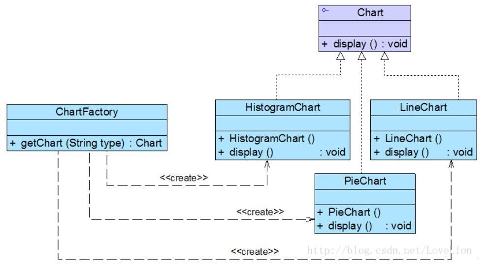

# 简单工厂模式应用实例
## 实例说明
> 某软件公司要基于Java语言开发一套图表库，该图标库可以为应用系统提供不同外观的图标，例如柱状图(HistogramChart)、饼状图(PieChart)、折线图(LineChart)等。该软件公司图表库设计人员希望为应用系统开发人员提供一套灵活易用的图表库，通过设置不同的参数即可得到不同类型的图表，而且可以较为方便地对图表库进行扩展，以便能够在将来增加一些新类型的图表。
>
>现使用简单工厂模式来设计该图表库。

## 实例类图


## 实例代码
```
//抽象图表接口：抽象产品类  
public interface Chart {  
    public void display();  
}  

//柱状图类：具体产品类  
public class HistogramChart implements Chart {  
    public HistogramChart() {  
        System.out.println("创建柱状图！");  
    }  

    public void display() {  
        System.out.println("显示柱状图！");  
    }  
}  

//饼状图类：具体产品类  
public class PieChart implements Chart {  
    public PieChart() {  
        System.out.println("创建饼状图！");  
    }  

    public void display() {  
        System.out.println("显示饼状图！");  
    }  
}  

//折线图类：具体产品类  
public class LineChart implements Chart {  
    public LineChart() {  
        System.out.println("创建折线图！");  
    }  

    public void display() {  
        System.out.println("显示折线图！");  
    }  
}  

//图表工厂类：工厂类  
public class ChartFactory {  
    //静态工厂方法  
    public static Chart getChart(String type) {  
        Chart chart = null;  
        if (type.equalsIgnoreCase("histogram")) {  
            chart = new HistogramChart();  
            System.out.println("初始化设置柱状图！");  
        }  
        else if (type.equalsIgnoreCase("pie")) {  
            chart = new PieChart();  
            System.out.println("初始化设置饼状图！");  
        }  
        else if (type.equalsIgnoreCase("line")) {  
            chart = new LineChart();  
            System.out.println("初始化设置折线图！");              
        }  
        return chart;  
    }  
}

//客户端测试类
public class Client {  
    public static void main(String args[]) {  
        Chart chart;  
        String type = XMLUtil.getChartType(); //读取配置文件中的参数  
        chart = ChartFactory.getChart(type); //创建产品对象  
        chart.display();  
    }  
}

//XML配置文件
<?xml version="1.0"?>  
<config>  
    <chartType>histogram</chartType>  
</config>

//工具类
public class XMLUtil {  
    //该方法用于从XML配置文件中提取图表类型，并返回类型名  
    public static String getChartType() {  
        try {  
            //创建文档对象  
            DocumentBuilderFactory dFactory = DocumentBuilderFactory.newInstance();  
            DocumentBuilder builder = dFactory.newDocumentBuilder();  
            Document doc;                             
            doc = builder.parse(new File("config.xml"));   

            //获取包含图表类型的文本节点  
            NodeList nl = doc.getElementsByTagName("chartType");  
            Node classNode = nl.item(0).getFirstChild();  
            String chartType = classNode.getNodeValue().trim();  
            return chartType;  
        }     
        catch(Exception e) {  
            e.printStackTrace();  
            return null;  
        }  
    }  
}
```
结果：
```
创建柱状图！
初始化设置柱状图！
显示柱状图！
```