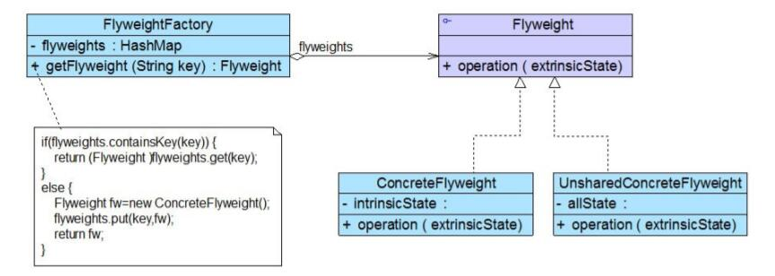

# 享元模式结构与实现

## 装饰模式结构
 
1. Flyweight（抽象享元类）：通常是一个接口或抽象类，在抽象享元类中声明了具体享元类公共的方法，这些方法可以向外界提供享元对象的内部数据（内部状态），同时也可以通过这些方法来设置外部数据（外部状态）。
2. ConcreteFlyweight（具体享元类）：它实现了抽象享元类，其实例称为享元对象；在具体享元类中为内部状态提供了存储空间。通常我们可以结合单例模式来设计具体享元类，为每一个具体享元类提供唯一的享元对象。
3. UnsharedConcreteFlyweight（非共享具体享元类）：并不是所有的抽象享元类的子类都需要被共享，不能被共享的子类可设计为非共享具体享元类；当需要一个非共享具体享元类的对象时可以直接通过实例化创建。
4. FlyweightFactory（享元工厂类）：享元工厂类用于创建并管理享元对象，它针对抽象享元类编程，将各种类型的具体享元对象存储在一个享元池中，享元池一般设计为一个存储“键值对”的集合（也可以是其他类型的集合），可以结合工厂模式进行设计；当用户请求一个具体享元对象时，享元工厂提供一个存储在享元池中已创建的实例或者创建一个新的实例（如果不存在的话），返回新创建的实例并将其存储在享元池中。

## 装饰模式实现
享元类的设计是享元模式的要点之一，为了提高系统的可扩展性，通常会定义一个抽象享元类作为所有具体享元类的公共父类，典型的抽象享元类代码如下：
```
public abstract class Flyweight{
    public abstract void operation(String extrinsicState);
}
```
在具体享元类ConcreteFlyweight中要将内部状态和外部状态分开处理，通常将内部状态作为享元类的成员变量，而外部状态通过注入的方式添加到具体享元类中。典型的享元类代码如下所示：
```
public class ConcreteFlyweight extends Flyweight {
    //内部状态intrinsicState作为成员变量，同一个享元对象其内部状态是一致的
    private String intrinsicState;

    public ConcreteFlyweight(String intrinsicState) {
        this.intrinsicState=intrinsicState;
    }

    //外部状态extrinsicState在使用时由外部设置，不保存在享元对象中，即使是同一个对象，在每一次调用时也可以传入不同的外部状态
    public void operation(String  extrinsicState) {
        //实现业务方法
    }     
}
```
除了可以共享的具体享元类以外，在使用享元模式时有时候还需要处理那些不需要共享的抽象享元类Flyweight的子类，这些子类被定义为非共享具体享元类UnsharedConcreteFlyweight，其典型代码如下：
```
public class UnsharedConcreteFlyweight extends Flyweight{
    public void operation(String extrinsicState){
        //实现业务方法
    }
}
```

在享元模式中引入了享元工厂类，享元工厂类的作用在于提供一个用于存储享元对象的享元池，当用户需要对象时，首先从享元池中获取，如果享元池中不存在，则创建一个新的享元对象返回给用户，并在享元池中保存该新增对象。典型的享元工厂类的代码如下：
```
public class FlyweightFactory {
    //定义一个HashMap用于存储享元对象，实现享元池
    private HashMap flyweights = newHashMap();

    public Flyweight getFlyweight(String key){
        //如果对象存在，则直接从享元池获取
        if(flyweights.containsKey(key)){
            return(Flyweight)flyweights.get(key);
        }
        //如果对象不存在，先创建一个新的对象添加到享元池中，然后返回
        else {
            Flyweight fw = newConcreteFlyweight();
            flyweights.put(key,fw);
            return fw;
        }
    }
}
```