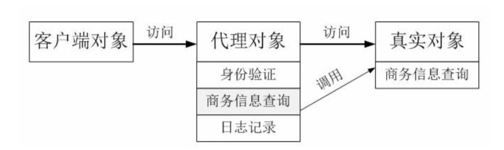
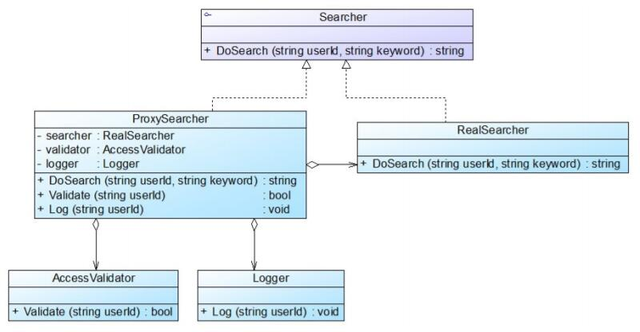

# 代理模式应用实例
## 实例说明
> 某软件公司承接了某信息咨询公司的收费商务信息查询系统的开发任务，该系统的基本需求如下：
>
>(1) 在进行商务信息查询之前用户需要通过身份验证，只有合法用户才能够使用该查询系统；
>
>(2) 在进行商务信息查询时系统需要记录查询日志，以便根据查询次数收取查询费用。
>
>该软件公司开发人员已完成了商务信息查询模块的开发任务，现希望能够以一种松耦合的方式向原有系统增加身份验证和日志记录功能，客户端代码可以无区别地对待原始的商务信息查询模块和增加新功能之后的商务信息查询模块，而且可能在将来还要在该信息查询模块中增加一些新的功能。
试使用代理模式设计并实现该收费商务信息查询系统。

## 实例类图
通过分析，可以采用一种间接访问的方式来实现该商务信息查询系统的设计，在客户端对象和信息查询对象之间增加一个代理对象，让代理对象来实现身份验证和日志记录等功能，而无须直接对原有的商务信息查询对象进行修改。




## 实例代码
```
//身份验证类，业务类，它提供方法Validate()来实现身份验证。
public class AccessValidator {  
    //模拟实现登录验证  
    public bool ValidateSstring userId) {  
        System.out.println("在数据库中验证用户'" + userId + "'是否是合法用户？");  
        if (userId.equalsIgnoreCase("杨过")) {  
            System.out.println("'" + userId + "'登录成功！");  
            return true;  
        }  
        else {  
            System.out.println("'" + userId + "'登录失败！");  
            return false;  
        }  
    }  
}

//日志记录类，业务类，它提供方法Log()来保存日志。
public class Logger {  
    //模拟实现日志记录  
    public void Log(String userId) {  
        System.out.println("更新数据库，用户'" + userId + "'查询次数加1！");  
    }  
}  

//Searcher：抽象查询类，充当抽象主题角色，它声明了DoSearch()方法。
public interface Searcher {  
    public String doSearch(String userId, String keyword);  
}  

//RealSearcher：具体查询类，充当真实主题角色，它实现查询功能，提供方法doSearch()来查询信息。
public class RealSearcher implements Searcher {  
    //模拟查询商务信息  
    public string doSearch(string userId, string keyword) {  
        System.out.println("用户'" + userId + "'使用关键词'" + keyword + "'查询商务信息！"); 
        return "返回具体内容";  
    }  
} 

//ProxySearcher：代理查询类，充当代理主题角色，它是查询代理，维持了对RealSearcher对象、AccessValidator对象和Logger对象的引用。
public class ProxySearcher extends Searcher {  
    private RealSearcher searcher = new RealSearcher(); //维持一个对真实主题的引用  
    private AccessValidator validator;  
    private Logger logger;  

    public String doSearch(String userId, String keyword) {  
        //如果身份验证成功，则执行查询  
        if (this.Validate(userId)) {  
            String result = searcher.doSearch(userId, keyword); //调用真实主题对象的查询方法 
            this.Log(userId); //记录查询日志  
            return result; //返回查询结果  
        }  
        else {  
            return null;  
        }  
    }  

    //创建访问验证对象并调用其Validate()方法实现身份验证  
    public bool Validate(string userId) {  
        validator = new AccessValidator();  
        return validator.Validate(userId);  
    }  

    //创建日志记录对象并调用其Log()方法实现日志记录  
    public void Log(string userId) {  
        logger = new Logger();  
        logger.Log(userId);  
    }  
}  

//配置文件，存储了代理主题类类名。
<?xml version="1.0"?>
<config>
    <className>designpatterns.proxy.ProxySearcher</className>
</config>

//客户端测试类
public class Client {
    public static void main(Sting args[]){
        Searcher searcher;
        searcher = (Searcher)XMLUtil.getBean();
        String result = searcher.doSearch("杨过","玉女心经");
    }
}
```
编译并运行程序，输出结果如下：
```
在数据库中验证用户'杨过'是否是合法用户？
'杨过'登录成功！
用户'杨过'使用关键词'玉女心经'查询商务信息！
更新数据库，用户'杨过'查询次数加1！
```