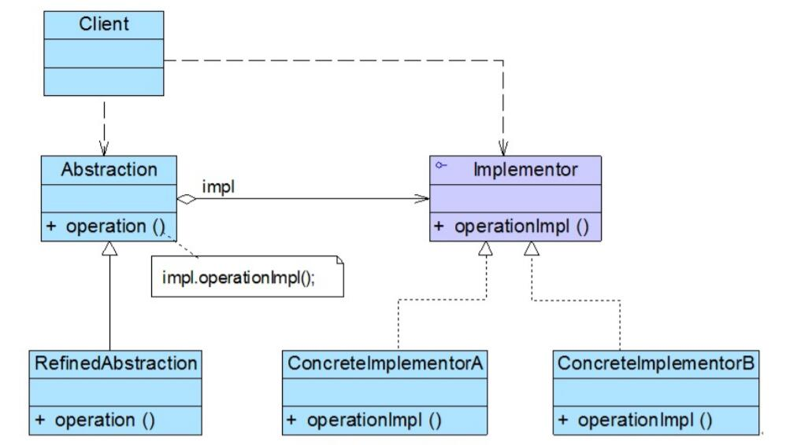
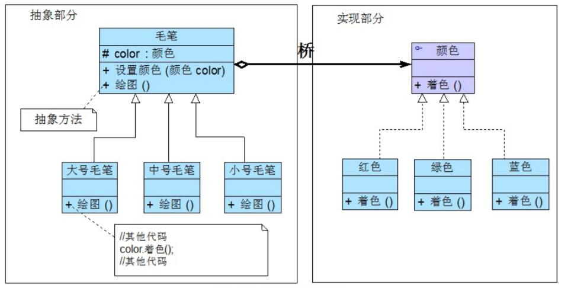

# 桥接模式结构与实现

## 桥接模式结构
1. Abstraction（抽象类）：用于定义抽象类的接口，它一般是抽象类而不是接口，其中定义了一个Implementor（实现类接口）类型的对象并可以维护该对象，它与Implementor之间具有关联关系，它既可以包含抽象业务方法，也可以包含具体业务方法。
2. RefinedAbstraction（扩充抽象类）：扩充由Abstraction定义的接口，通常情况下它不再是抽象类而是具体类，它实现了在Abstraction中声明的抽象业务方法，在RefinedAbstraction中可以调用在Implementor中定义的业务方法。
3. Implementor（实现类接口）：定义实现类的接口，这个接口不一定要与Abstraction的接口完全一致，事实上这两个接口可以完全不同，一般而言，Implementor接口仅提供基本操作，而Abstraction定义的接口可能会做更多更复杂的操作。Implementor接口对这些基本操作进行了声明，而具体实现交给其子类。通过关联关系，在Abstraction中不仅拥有自己的方法，还可以调用到Implementor中定义的方法，使用关联关系来替代继承关系。
4. ConcreteImplementor（具体实现类）：具体实现Implementor接口，在不同的ConcreteImplementor中提供基本操作的不同实现，在程序运行时，ConcreteImplementor对象将替换其父类对象，提供给抽象类具体的业务操作方法。


## 桥接模式实现
在使用桥接模式时，我们首先应该识别出一个类所具有的两个独立变化的维度，将它们设计为两个独立的继承等级结构，为两个维度都提供抽象层，并建立抽象耦合。通常情况下，我们将具有两个独立变化维度的类的一些普通业务方法和与之关系最密切的维度设计为“抽象类”层次结构（抽象部分），而将另一个维度设计为“实现类”层次结构（实现部分）。



在具体编码实现时，由于在桥接模式中存在两个独立变化的维度，为了使两者之间耦合度降低，首先需要针对两个不同的维度提取抽象类和实现类接口，并建立一个抽象关联关系。对于“实现部分”维度，典型的实现类接口代码如下所示：
```
public interface Implementor {  
    public void operationImpl();  
}
```
在实现Implementor接口的子类中实现了在该接口中声明的方法，用于定义与该维度相对应的一些具体方法。
对于另一“抽象部分”维度而言，其典型的抽象类代码如下所示：
```
public abstract class Abstraction {  
    protected Implementor impl; //定义实现类接口对象  

    public void setImpl(Implementor impl) {  
        this.impl=impl;  
    }  

    public abstract void operation();  //声明抽象业务方法  
}
```
在抽象类Abstraction中定义了一个实现类接口类型的成员对象impl，再通过注入的方式给该对象赋值，一般将该对象的可见性定义为protected，以便在其子类中访问Implementor的方法，其子类一般称为扩充抽象类或细化抽象类(RefinedAbstraction)，典型的RefinedAbstraction类代码如下所示：
```
public class RefinedAbstraction extends Abstraction {  
    public void operation() {  
        //业务代码  
        impl.operationImpl();  //调用实现类的方法  
        //业务代码  
    }  
}
```
对于客户端而言，可以针对两个维度的抽象层编程，在程序运行时再动态确定两个维度的子类，动态组合对象，将两个独立变化的维度完全解耦，以便能够灵活地扩充任一维度而对另一维度不造成任何影响。