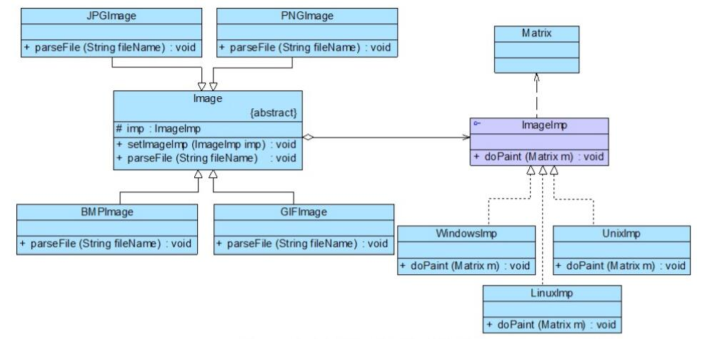

# 桥接模式应用实例
## 实例说明
> 某软件公司欲开发一个跨平台图像浏览系统，要求该系统能够显示BMP、JPG、GIF、PNG等多种格式的文件，并且能够在Windows、Linux、Unix等多个操作系统上运行。系统首先将各种格式的文件解析为像素矩阵(Matrix)，然后将像素矩阵显示在屏幕上，在不同的操作系统中可以调用不同的绘制函数来绘制像素矩阵。系统需具有较好的扩展性以支持新的文件格式和操作系统。
>
>试使用桥接模式设计该快平台图像浏览系统

## 实例类图


## 实例代码
```
//像素矩阵类：辅助类，各种格式的文件最终都被转化为像素矩阵，不同的操作系统提供不同的方式显示像素矩阵  
public class Matrix {  
    //此处代码省略  
}  

//抽象操作系统实现类：实现类接口  
public interface ImageImp {  
    public void doPaint(Matrix m);  //显示像素矩阵m  
}   

//Windows操作系统实现类：具体实现类  
public class WindowsImp implements ImageImp {  
    public void doPaint(Matrix m) {  
        //调用Windows系统的绘制函数绘制像素矩阵  
        System.out.print("在Windows操作系统中显示图像：");  
    }  
}  

//Linux操作系统实现类：具体实现类  
public class LinuxImp implements ImageImp {  
    public void doPaint(Matrix m) {  
        //调用Linux系统的绘制函数绘制像素矩阵  
        System.out.print("在Linux操作系统中显示图像：");  
    }  
}  

//Unix操作系统实现类：具体实现类  
public class UnixImp implements ImageImp {  
    public void doPaint(Matrix m) {  
        //调用Unix系统的绘制函数绘制像素矩阵  
        System.out.print("在Unix操作系统中显示图像：");  
    }  
}  

//抽象图像类：抽象类  
public public abstract class Image {  
    protected ImageImp imp;  

    public void setImageImp(ImageImp imp) {  
        this.imp = imp;  
    }   

    public abstract void parseFile(String fileName);  
}  

//JPG格式图像：扩充抽象类  
public class JPGImage extends Image {  
    public void parseFile(String fileName) {  
        //模拟解析JPG文件并获得一个像素矩阵对象m;  
        Matrix m = new Matrix();   
        imp.doPaint(m);  
        System.out.println(fileName + "，格式为JPG。");  
    }  
}  

//PNG格式图像：扩充抽象类  
public class PNGImage extends Image {  
    public void parseFile(String fileName) {  
        //模拟解析PNG文件并获得一个像素矩阵对象m;  
        Matrix m = new Matrix();   
        imp.doPaint(m);  
        System.out.println(fileName + "，格式为PNG。");  
    }  
}  

//BMP格式图像：扩充抽象类  
public class BMPImage extends Image {  
    public void parseFile(String fileName) {  
        //模拟解析BMP文件并获得一个像素矩阵对象m;  
        Matrix m = new Matrix();   
        imp.doPaint(m);  
        System.out.println(fileName + "，格式为BMP。");  
    }  
}  

//GIF格式图像：扩充抽象类  
public class GIFImage extends Image {  
    public void parseFile(String fileName) {  
        //模拟解析GIF文件并获得一个像素矩阵对象m;  
        Matrix m = new Matrix();   
        imp.doPaint(m);  
        System.out.println(fileName + "，格式为GIF。");  
    }  
}

//配置文件
<?xml version="1.0"?>  
<config>  
    <!--RefinedAbstraction-->  
    <className>JPGImage</className>   
    <!--ConcreteImplementor-->  
    <className>WindowsImp</className>  
</config>

//客户端测试类
public class Client {  
    public static void main(String args[]) {  
        Image image;  
        ImageImp imp;  
        image = (Image)XMLUtil.getBean("image");  
        imp = (ImageImp)XMLUtil.getBean("os");  
        image.setImageImp(imp);  
        image.parseFile("小龙女");  
    }  
}
```
编译并运行程序，输出结果如下：
```
在Windows操作系统中显示图像：小龙女，格式为JPG。
```