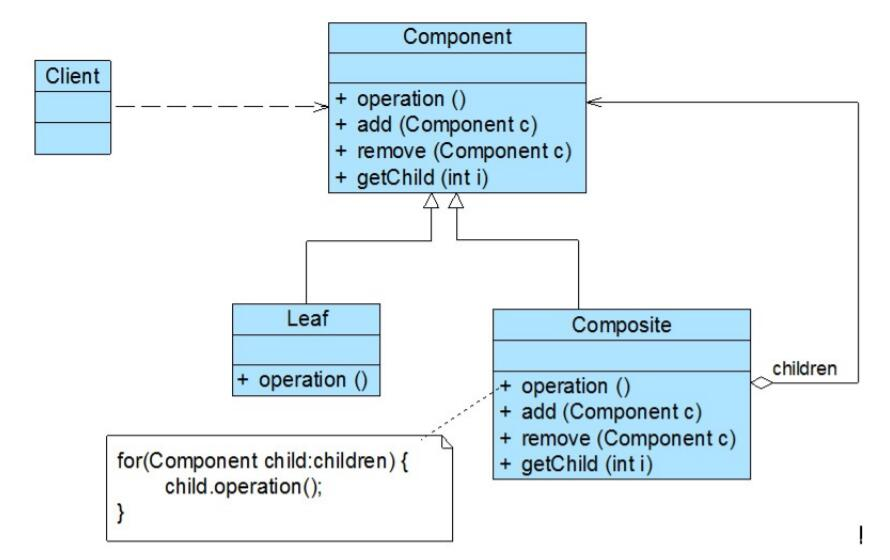

# 组合模式结构与实现

## 组合模式结构

1. Component（抽象构件）：它可以是接口或抽象类，为叶子构件和容器构件对象声明接口，在该角色中可以包含所有子类共有行为的声明和实现。在抽象构件中定义了访问及管理它的子构件的方法，如增加子构件、删除子构件、获取子构件等。
2. Leaf（叶子构件）：它在组合结构中表示叶子节点对象，叶子节点没有子节点，它实现了在抽象构件中定义的行为。对于那些访问及管理子构件的方法，可以通过异常等方式进行处理。
3. Composite（容器构件）：它在组合结构中表示容器节点对象，容器节点包含子节点，其子节点可以是叶子节点，也可以是容器节点，它提供一个集合用于存储子节点，实现了在抽象构件中定义的行为，包括那些访问及管理子构件的方法，在其业务方法中可以递归调用其子节点的业务方法。

## 组合模式实现
组合模式的关键是定义了一个抽象构件类，它既可以代表叶子，又可以代表容器，而客户端针对该抽象构件类进行编程，无须知道它到底表示的是叶子还是容器，可以对其进行统一处理。同时容器对象与抽象构件类之间还建立一个聚合关联关系，在容器对象中既可以包含叶子，也可以包含容器，以此实现递归组合，形成一个树形结构。

对于组合模式中的抽象构件角色，其典型代码如下所示：
```
public abstract class Component {  
    public abstract void add(Component c); //增加成员  
    public abstract void remove(Component c); //删除成员  
    public abstract Component getChild(int i); //获取成员  
    public abstract void operation();  //业务方法  
}
```
一般将抽象构件类设计为接口或抽象类，将所有子类共有方法的声明和实现放在抽象构件类中。对于客户端而言，将针对抽象构件编程，而无须关心其具体子类是容器构件还是叶子构件。

如果继承抽象构件的是叶子构件，则其典型代码如下所示：
```
public class Leaf extends Component {  
    public void add(Component c) {   
        //异常处理或错误提示   
    }     

    public void remove(Component c) {   
        //异常处理或错误提示   
    }  

    public Component getChild(int i) {   
        //异常处理或错误提示  
        return null;   
    }  

    public void operation() {  
        //叶子构件具体业务方法的实现  
    }   
}
```
作为抽象构件类的子类，在叶子构件中需要实现在抽象构件类中声明的所有方法，包括业务方法以及管理和访问子构件的方法，但是叶子构件不能再包含子构件，因此在叶子构件中实现子构件管理和访问方法时需要提供异常处理或错误提示。当然，这无疑会给叶子构件的实现带来麻烦。

如果继承抽象构件的是容器构件，则其典型代码如下所示：
```
public class Composite extends Component {  
    private ArrayList<Component> list = new ArrayList<Component>();  

    public void add(Component c) {  
        list.add(c);  
    }  

    public void remove(Component c) {  
        list.remove(c);  
    }  

    public Component getChild(int i) {  
        return (Component)list.get(i);  
    }  

    public void operation() {  
        //容器构件具体业务方法的实现  
        //递归调用成员构件的业务方法  
        for(Object obj:list) {  
            ((Component)obj).operation();  
        }  
    }     
}
```
在容器构件中实现了在抽象构件中声明的所有方法，既包括业务方法，也包括用于访问和管理成员子构件的方法，如add()、remove()和getChild()等方法。需要注意的是在实现具体业务方法时，由于容器构件充当的是容器角色，包含成员构件，因此它将调用其成员构件的业务方法。在组合模式结构中，由于容器构件中仍然可以包含容器构件，因此在对容器构件进行处理时需要使用递归算法，即在容器构件的operation()方法中递归调用其成员构件的operation()方法。