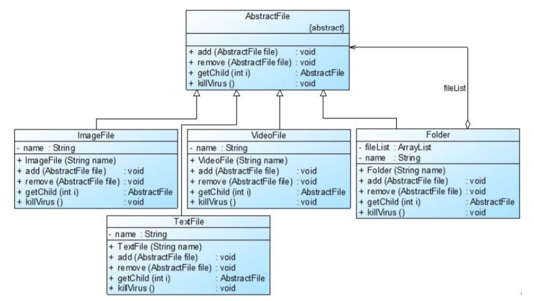

# 组合模式应用实例
## 实例说明
> 某软件公司欲开发一个杀毒(AntiVirus)软件，该软件既可以对某个文件夹(Folder)杀毒，也可以对某个指定的文件(File)进行杀毒。该杀毒软件还可以根据各类文件的特点，为不同类型的文件提供不同的杀毒方式，例如图像文件(ImageFile)和文本文件(TextFile)的杀毒方式就有所差异。
>
>现使用组合模式来设计该杀毒软件的整体框架。

## 实例类图


## 实例代码
```
//抽象文件类：抽象构件  
public abstract class AbstractFile {  
    public abstract void add(AbstractFile file);  
    public abstract void remove(AbstractFile file);  
    public abstract AbstractFile getChild(int i);  
    public abstract void killVirus();  
}  

//图像文件类：叶子构件  
public class ImageFile extends AbstractFile {  
    private String name;  

    public ImageFile(String name) {  
        this.name = name;  
    }  

    public void add(AbstractFile file) {  
       System.out.println("对不起，不支持该方法！");  
    }  

    public void remove(AbstractFile file) {  
        System.out.println("对不起，不支持该方法！");  
    }  

    public AbstractFile getChild(int i) {  
        System.out.println("对不起，不支持该方法！");  
        return null;  
    }  

    public void killVirus() {  
        //模拟杀毒  
        System.out.println("----对图像文件'" + name + "'进行杀毒");  
    }  
}  

//文本文件类：叶子构件  
public class TextFile extends AbstractFile {  
    private String name;  

    public TextFile(String name) {  
        this.name = name;  
    }  

    public void add(AbstractFile file) {  
       System.out.println("对不起，不支持该方法！");  
    }  

    public void remove(AbstractFile file) {  
        System.out.println("对不起，不支持该方法！");  
    }  

    public AbstractFile getChild(int i) {  
        System.out.println("对不起，不支持该方法！");  
        return null;  
    }  

    public void killVirus() {  
        //模拟杀毒  
        System.out.println("----对文本文件'" + name + "'进行杀毒");  
    }  
}  

//视频文件类：叶子构件  
public class VideoFile extends AbstractFile {  
    private String name;  

    public VideoFile(String name) {  
        this.name = name;  
    }  

    public void add(AbstractFile file) {  
       System.out.println("对不起，不支持该方法！");  
    }  

    public void remove(AbstractFile file) {  
        System.out.println("对不起，不支持该方法！");  
    }  

    public AbstractFile getChild(int i) {  
        System.out.println("对不起，不支持该方法！");  
        return null;  
    }  

    public void killVirus() {  
        //模拟杀毒  
        System.out.println("----对视频文件'" + name + "'进行杀毒");  
    }  
}  

//文件夹类：容器构件  
public class Folder extends AbstractFile {  
    //定义集合fileList，用于存储AbstractFile类型的成员  
    private ArrayList<AbstractFile> fileList=new ArrayList<AbstractFile>();  
    private String name;  

    public Folder(String name) {  
        this.name = name;  
    }  

    public void add(AbstractFile file) {  
       fileList.add(file);    
    }  

    public void remove(AbstractFile file) {  
        fileList.remove(file);  
    }  

    public AbstractFile getChild(int i) {  
        return (AbstractFile)fileList.get(i);  
    }  

    public void killVirus() {  
        System.out.println("****对文件夹'" + name + "'进行杀毒");  //模拟杀毒  

        //递归调用成员构件的killVirus()方法  
        for(Object obj : fileList) {  
            ((AbstractFile)obj).killVirus();  
        }  
    }  
}

//客户端测试代码：
public class Client {  
    public static void main(String args[]) {  
        //针对抽象构件编程  
        AbstractFile file1,file2,file3,file4,file5,folder1,folder2,folder3,folder4;  

        folder1 = new Folder("Sunny的资料");  
        folder2 = new Folder("图像文件");  
        folder3 = new Folder("文本文件");  
        folder4 = new Folder("视频文件");  

        file1 = new ImageFile("小龙女.jpg");  
        file2 = new ImageFile("张无忌.gif");  
        file3 = new TextFile("九阴真经.txt");  
        file4 = new TextFile("葵花宝典.doc");  
        file5 = new VideoFile("笑傲江湖.rmvb");  

        folder2.add(file1);  
        folder2.add(file2);  
        folder3.add(file3);  
        folder3.add(file4);  
        folder4.add(file5);  
        folder1.add(folder2);  
        folder1.add(folder3);  
        folder1.add(folder4);  

        //从“Sunny的资料”节点开始进行杀毒操作  
        folder1.killVirus();  
    }  
}
```
编译并运行程序，输出结果如下：
```
****对文件夹'Sunny的资料'进行杀毒
****对文件夹'图像文件'进行杀毒
----对图像文件'小龙女.jpg'进行杀毒
----对图像文件'张无忌.gif'进行杀毒
****对文件夹'文本文件'进行杀毒
----对文本文件'九阴真经.txt'进行杀毒
----对文本文件'葵花宝典.doc'进行杀毒
****对文件夹'视频文件'进行杀毒
----对视频文件'笑傲江湖.rmvb'进行杀毒
```