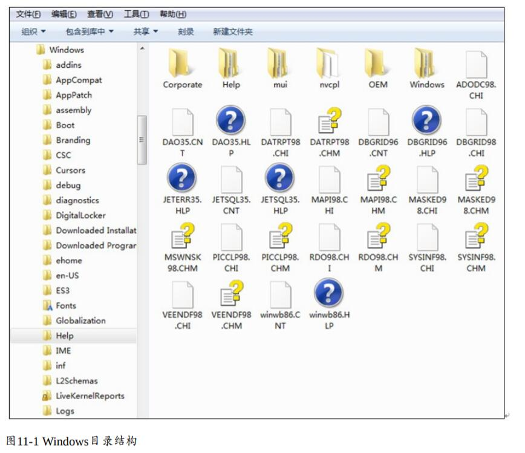
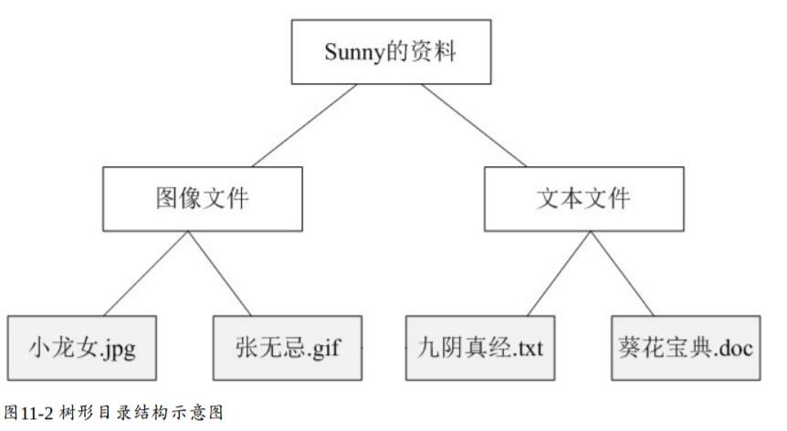

# 组合模式
组织模式通过一种巧妙的设计方案似的用户可以一致性地处理整个树形结构或者树形结构的一部分，它描述了如何将容器对象和叶子对象进行递归组合，使得用户在使用时无须对它们进行区分，可以一致地对待容器对象和叶子对象。

> 组合模式(Composite Pattern)：组合多个对象形成树形结构以表示具有部分-整体关系的层次结构。组合模式让客户端可以统一地对待单个对象和组合对象。

组合模式又可以称为“部分—整体”(Part-Whole)模式，它是一种**对象结构型模式**。它将对象组织到树形结构中，可以用来描述整体与部分的关系。

