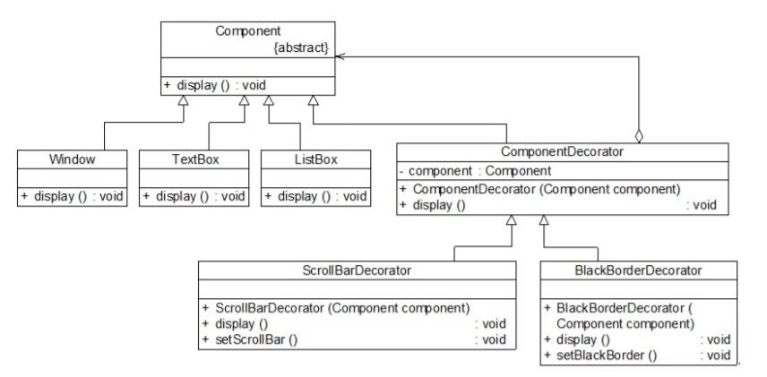

# 装饰模式应用实例
## 实例说明
> 某软件公司基于面向对象技术开发了一套图形界面构件库VisualComponent，该构件库提供了大量基本构件，如窗体、文本框、列表框等，由于在使用该构件库时，用户经常要求定制一些特效显示效果，如带滚动条的窗体、带黑色边框的文本框、既带滚动条又带黑色边框的列表框等等，因此经常需要对该构件库进行扩展以增强其功能。
>
>现使用装饰模式来设计该图形界面构件库。

## 实例类图


## 实例代码
```
//抽象界面构件类：抽象构件类，为了突出与模式相关的核心代码，对原有控件代码进行了大量的简化
public abstract class Component
{
    public abstract void display();
}

//窗体类：具体构件类
public class Window extends Component
{
    public void display()
    {
        System.out.println("显示窗体！");
    }
}

//文本框类：具体构件类
public class TextBox extends Component
{
    public void display()
    {
        System.out.println("显示文本框！");
    }
}

//列表框类：具体构件类
public class ListBox extends Component
{
    public void display()
    {
        System.out.println("显示列表框！");
    }
}

//构件装饰类：抽象装饰类
public class ComponentDecorator extends Component
{
    private Component component;  //维持对抽象构件类型对象的引用

    public ComponentDecorator(Component  component)  //注入抽象构件类型的对象
    {
        this.component = component;
    }

    public void display()
    {
        component.display();
    }
}

//滚动条装饰类：具体装饰类
public class ScrollBarDecorator extends  ComponentDecorator
{
    public ScrollBarDecorator(Component  component)
    {
        super(component);
    }

    public void display()
    {
        this.setScrollBar();
        super.display();
    }

    public void setScrollBar()
    {
        System.out.println("为构件增加滚动条！");
    }
}

//黑色边框装饰类：具体装饰类
public class BlackBorderDecorator extends  ComponentDecorator
{
    public BlackBorderDecorator(Component  component)
    {
        super(component);
    }

    public void display()
    {
        this.setBlackBorder();
        super.display();
    }

    public void setBlackBorder()
    {
        System.out.println("为构件增加黑色边框！");
    }
}

//客户端测试代码：
public class Client
{
    public static void main(String args[])
    {
        Component component,componentSB;  //使用抽象构件定义
        component = new Window(); //定义具体构件
        componentSB = new  ScrollBarDecorator(component); //定义装饰后的构件
        componentSB.display();
    }
}
```
编译并运行程序，输出结果如下：
```
为构件增加滚动条！
显示窗体！
```
在客户端代码中，我们先定义了一个Window类型的具体构件对象component，然后将component作为构造函数的参数注入到具体装饰类ScrollBarDecorator中，得到一个装饰之后对象componentSB，再调用componentSB的display()方法后将得到一个有滚动条的窗体。如果我们希望得到一个**既有滚动条又有黑色边框的窗体**，不需要对原有类库进行任何修改，只需将客户端代码修改为如下所示：
```
public class Client
{
    public static void main(String args[])
    {
        Component  component,componentSB,componentBB; //全部使用抽象构件定义
        component = new Window();
        componentSB = new  ScrollBarDecorator(component);
        componentBB = new  BlackBorderDecorator(componentSB); //将装饰了一次之后的对象继续注入到另一个装饰类中，进行第二次装饰
        componentBB.display();
    }
}
```
编译并运行程序，输出结果如下：
```
为构件增加黑色边框！
为构件增加滚动条！
显示窗体！
```
将装饰了一次之后的componentSB对象注入另一个装饰类BlackBorderDecorator中实现第二次装饰，得到一个经过两次装饰的对象componentBB，再调用componentBB的display()方法即可得到一个既有滚动条又有黑色边框的窗体。

如果需要在原有系统中增加一个新的具体构件类或者新的具体装饰类，无须修改现有类库代码，只需将它们分别作为抽象构件类或者抽象装饰类的子类即可。