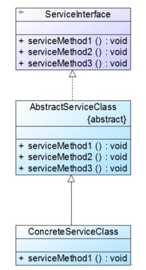
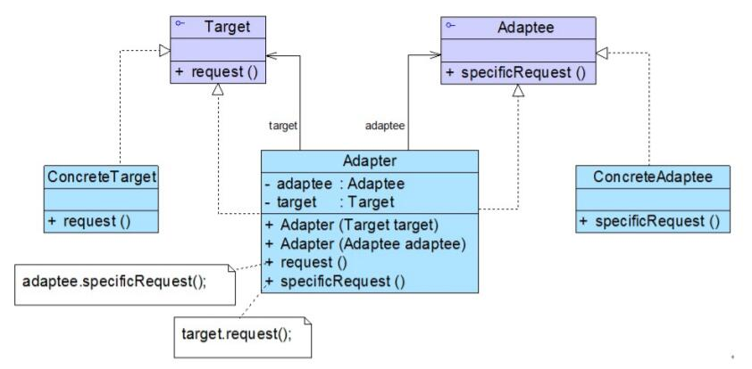

# 其他适配器
## 缺省适配器
缺省适配器模式是适配器模式的一种变体，其应用也较为广泛。缺省适配器模式的定义如下：

> 缺省适配器模式(Default Adapter Pattern)：当不需要实现一个接口所提供的所有方法时，可先设计一个抽象类实现该接口，并为接口中每个方法提供一个默认实现（空方法），那么该抽象类的子类可以选择性地覆盖父类的某些方法来实现需求，它适用于不想使用一个接口中的所有方法的情况，又称为单接口适配器模式。

* ServiceInterface（适配者接口）：它是一个接口，通常在该接口中声明了大量的方法。
* AbstractServiceClass（缺省适配器类）：它是缺省适配器模式的核心类，使用空方法的形式实现了在ServiceInterface接口中声明的方法。通常将它定义为抽象类，因为对它进行实例化没有任何意义。
* ConcreteServiceClass（具体业务类）：它是缺省适配器类的子类，在没有引入适配器之前，它需要实现适配者接口，因此需要实现在适配者接口中定义的所有方法，而对于一些无须使用的方法也不得不提供空实现。在有了缺省适配器之后，可以直接继承该适配器类，根据需要有选择性地覆盖在适配器类中定义的方法。

```
public abstract class AbstractServiceClass implements ServiceInterface{
    public void serviceMethod1(){ } //空方法
    public void serviceMethod2(){ } //空方法
    public void serviceMethod3(){ } //空方法
}
```

## 双向适配器
在对象适配器的使用过程中，如果在适配器中同时包含对目标类和适配者类的引用，适配者
可以通过它调用目标类中的方法，目标类也可以通过它调用适配者类中的方法，那么该适配
器就是一个双向适配器。

```
public class Adapter implements Target,Adaptee {  
    //同时维持对抽象目标类和适配者的引用  
    private Target target;  
    private Adaptee adaptee;  

    public Adapter(Target target) {  
        this.target = target;  
    }  

    public Adapter(Adaptee adaptee) {  
        this.adaptee = adaptee;  
    }  

    public void request() {  
        adaptee.specificRequest();  
    }  

    public void specificRequest() {  
        target.request();  
    }  
}
```
