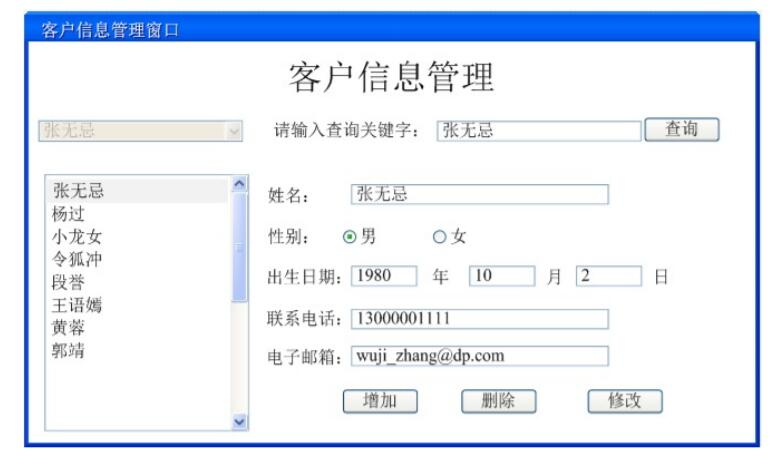
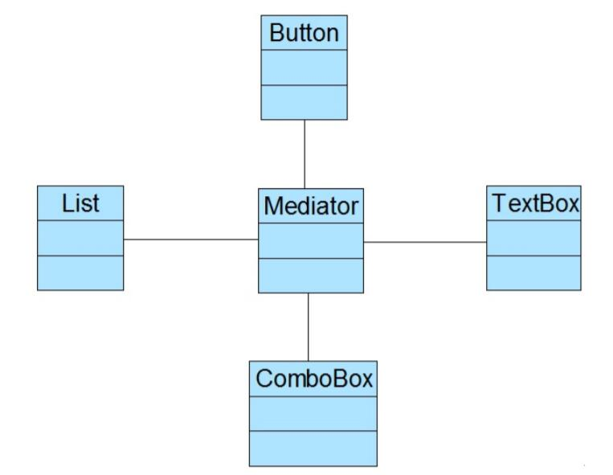
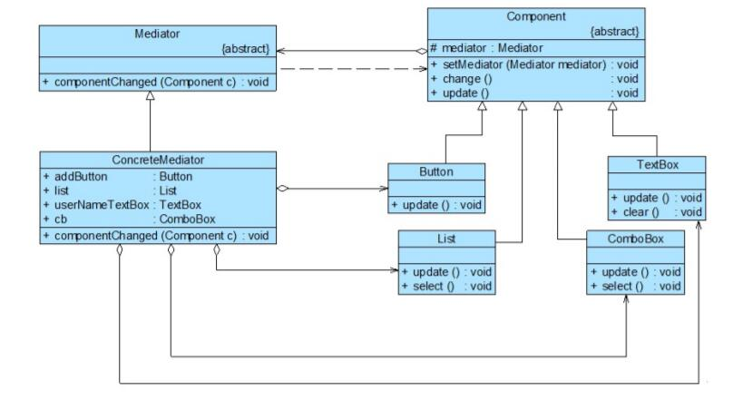

# 中介者 模式应用实例
## 实例说明
>某软件公司要开发一套CRM系统，其中包含一个客户信息管理模块，所设计的“客户信息管理窗口”界面效果图如下。
>
>
>
>通过分析发现，界面组件之间存在较为复杂的交互关系：如果删除一个客户，要在客户列表(List)中删掉对应的项，客户选择组合框(ComboBox)中客户名称也将减少一个；如果增加一个客户信息，客户列表中需增加一个客户，且组合框中也将增加一项。
为了更好地处理界面组件之间的交互，现使用中介者模式设计该系统。

## 实例类图
为了协调界面组件对象之间的复杂交互对象，可引入一个中介者类，其结构如图所示。    



在具体实现时，为了确保系统具有更好的灵活性和可扩展性，需要定义抽象中介者和抽象组件类，其中抽象组件类是所有具体组件类的公共父类，完整类图如下所示：



## 实例代码
```
//抽象中介者  
public abstract class Mediator {  
    public abstract void componentChanged(Component c);  
}  

//具体中介者  
public class ConcreteMediator extends Mediator {  
    //维持对各个同事对象的引用  
    public Button addButton;  
    public List list;  
    public TextBox userNameTextBox;  
    public ComboBox cb;  

    //封装同事对象之间的交互  
    public void componentChanged(Component c) {  
        //单击按钮  
        if(c == addButton) {  
            System.out.println("--单击增加按钮--");  
            list.update();  
            cb.update();  
            userNameTextBox.update();  
        }  
        //从列表框选择客户  
        else if(c == list) {  
            System.out.println("--从列表框选择客户--");  
            cb.select();  
            userNameTextBox.setText();  
        }  
        //从组合框选择客户  
        else if(c == cb) {  
            System.out.println("--从组合框选择客户--");  
            cb.select();  
            userNameTextBox.setText();  
        }  
    }  
}  

//抽象组件类：抽象同事类  
public abstract class Component {  
    protected Mediator mediator;  

    public void setMediator(Mediator mediator) {  
        this.mediator = mediator;  
    }  

    //转发调用  
    public void changed() {  
        mediator.componentChanged(this);  
    }  

    public abstract void update();    
}  

//按钮类：具体同事类  
public class Button extends Component {  
    public void update() {  
        //按钮不产生交互  
    }  
}  

//列表框类：具体同事类  
public class List extends Component {  
    public void update() {  
        System.out.println("列表框增加一项：张无忌。");  
    }  

    public void select() {  
        System.out.println("列表框选中项：小龙女。");  
    }  
}  

//组合框类：具体同事类  
public class ComboBox extends Component {  
    public void update() {  
        System.out.println("组合框增加一项：张无忌。");  
    }  

    public void select() {  
        System.out.println("组合框选中项：小龙女。");  
    }  
}  

//文本框类：具体同事类  
public class TextBox extends Component {  
    public void update() {  
        System.out.println("客户信息增加成功后文本框清空。");  
    }  

    public void setText() {  
        System.out.println("文本框显示：小龙女。");  
    }  
}
```
编写如下客户端测试代码：
```
public class Client {  
    public static void main(String args[]) {  
        //定义中介者对象  
        ConcreteMediator mediator;  
        mediator = new ConcreteMediator();  

        //定义同事对象  
        Button addBT = new Button();  
        List list = new List();  
        ComboBox cb = new ComboBox();  
        TextBox userNameTB = new TextBox();  

        addBT.setMediator(mediator);  
        list.setMediator(mediator);  
        cb.setMediator(mediator);  
        userNameTB.setMediator(mediator);  

        mediator.addButton = addBT;  
        mediator.list = list;  
        mediator.cb = cb;  
        mediator.userNameTextBox = userNameTB;  

        addBT.changed();  
        System.out.println("-----------------------------");  
        list.changed();  
    }  
}
```
编译并运行程序，输出结果如下：
```
--单击增加按钮--
列表框增加一项：张无忌。
组合框增加一项：张无忌。
客户信息增加成功后文本框清空。
-----------------------------
--从列表框选择客户--
组合框选中项：小龙女。
文本框显示：小龙女。
```