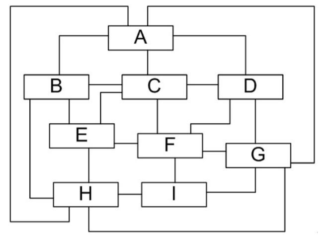
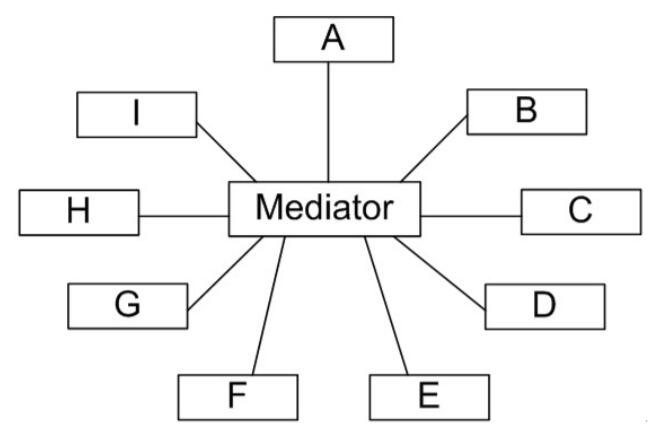

# 中介者模式
如果在一个系统中对象之间的联系呈现为网状结构，对象之间存在大量的多对多联系，将导致系统非常复杂，这些对象既会影响别的对象，也会被别的对象所影响，这些对象称为同事对象，它们之间通过彼此的相互作用实现系统的行为。在网状结构中，几乎每个对象都需要与其他对象发生相互作用，而这种相互作用表现为一个对象与另外一个对象的直接耦合，这将导致一个过度耦合的系统。

中介者模式可以使对象之间的关系数量急剧减少，通过引入中介者对象，可以将系统的网状结构变成以中介者为中心的星形结构。在这个星形结构中，同事对象不再直接与另一个对象联系，它通过中介者对象与另一个对象发生相互作用。中介者对象的存在保证了对象结构上的稳定，也就是说，系统的结构不会因为新对象的引入带来大量的修改工作。

 

如果在一个系统中对象之间存在多对多的相互关系，我们可以将对象之间的一些交互行为从各个对象中分离出来，并集中封装在一个中介者对象中，并由该中介者进行统一协调，这样对象之间多对多的复杂关系就转化为相对简单的一对多关系。

>中介者模式(Mediator Pattern)：定义一个对象来封装一系列对象的交互。中介者模式使各对象之间不需要显式地相互引用，从而使其耦合松散，而且用户可以独立地改变它们之间的交互。

中介者模式又称为调停者模式，它是一种**对象行为型**模式。在中介者模式中，通过引入中介者来简化对象之间的复杂交互，中介者模式是**迪米特法则**的一个典型应用。