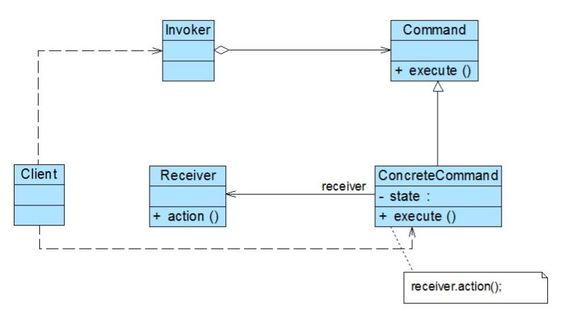

# 命令模式结构与实现

## 命令模式结构
   
1. Command（抽象命令类）：抽象命令类一般是一个抽象类或接口，在其中声明了用于执行
请求的execute()等方法，通过这些方法可以调用请求接收者的相关操作。
2. ConcreteCommand（具体命令类）：具体命令类是抽象命令类的子类，实现了在抽象命令类
中声明的方法，它对应具体的接收者对象，将接收者对象的动作绑定其中。在实现execute()方
法时，将调用接收者对象的相关操作(Action)。
3. Invoker（调用者）：调用者即请求发送者，它通过命令对象来执行请求。一个调用者并不
需要在设计时确定其接收者，因此它只与抽象命令类之间存在关联关系。在程序运行时可以
将一个具体命令对象注入其中，再调用具体命令对象的execute()方法，从而实现间接调用请求
接收者的相关操作。
4. Receiver（接收者）：接收者执行与请求相关的操作，它具体实现对请求的业务处理。

## 命令模式实现
命令模式的本质是对请求进行封装，一个请求对应于一个命令，将发出命令的责任和执行命令的责任分割开。每一个命令都是一个操作：请求的一方发出请求要求执行一个操作；接收的一方收到请求，并执行相应的操作。命令模式允许请求的一方和接收的一方独立开来，使得请求的一方不必知道接收请求的一方的接口，更不必知道请求如何被接收、操作是否被执行、何时被执行，以及是怎么被执行的。
```
public abstract class Command {  
    public abstract void execute();  
}
```
对于请求发送者即调用者而言，将针对抽象命令类进行编程，可以通过构造注入或者设值注入的方式在运行时传入具体命令类对象，并在业务方法中调用命令对象的execute()方法，其典型代码如下所示：
```
public class Invoker {  
    private Command command;  

    //构造注入  
    public Invoker(Command command) {  
        this.command = command;  
    }  

    //设值注入  
    public void setCommand(Command command) {  
        this.command = command;  
    }  

    //业务方法，用于调用命令类的execute()方法  
    public void call() {  
        command.execute();  
    }  
}
```
具体命令类继承了抽象命令类，它与请求接收者相关联，实现了在抽象命令类中声明的execute()方法，并在实现时调用接收者的请求响应方法action()，其典型代码如下所示：
```
public class ConcreteCommand extends Command {  
    private Receiver receiver; //维持一个对请求接收者对象的引用  

    public void execute() {  
        receiver.action(); //调用请求接收者的业务处理方法action()  
    }  
}
```
请求接收者Receiver类具体实现对请求的业务处理，它提供了action()方法，用于执行与请求相关的操作，其典型代码如下所示：
```
public class Receiver {  
    public void action() {  
        //具体操作  
    }  
}
```