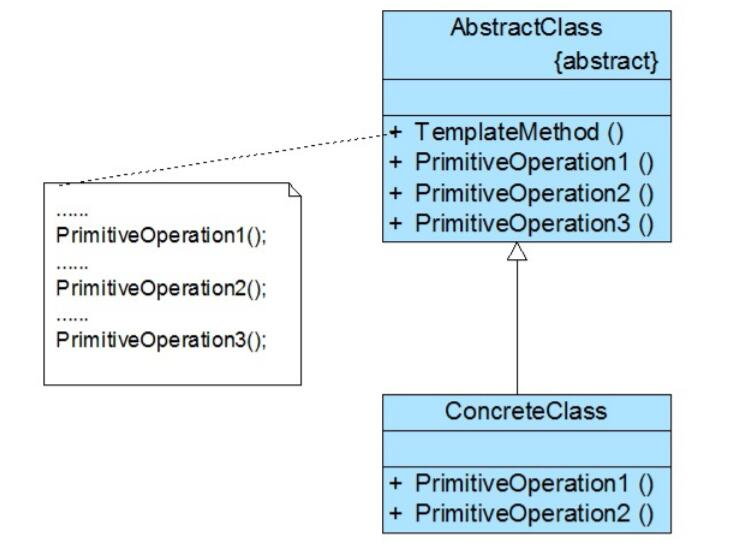

# 模板方法模式结构与实现

## 模板方法模式结构
  
1. AbstractClass（抽象类）：在抽象类中定义了一系列基本操作(PrimitiveOperations)，这些基本操作可以是具体的，也可以是抽象的，每一个基本操作对应算法的一个步骤，在其子类中可以重定义或实现这些步骤。同时，在抽象类中实现了一个模板方法(Template Method)，用于定义一个算法的框架，模板方法不仅可以调用在抽象类中实现的基本方法，也可以调用在抽象类的子类中实现的基本方法，还可以调用其他对象中的方法。
2. ConcreteClass（具体子类）：它是抽象类的子类，用于实现在父类中声明的抽象基本操作以完成子类特定算法的步骤，也可以覆盖在父类中已经实现的具体基本操作。

## 模板方法模式实现
### 模板方法
一个模板方法是定义在抽象类中的、把基本操作方法组合在一起形成一个总算法或一个总行为的方法。这个模板方法定义在抽象类中，并由子类不加以修改地完全继承下来。模板方法是一个具体方法，它给出了一个顶层逻辑框架，而逻辑的组成步骤在抽象类中可以是具体方法，也可以是抽象方法。由于模板方法是具体方法，因此模板方法模式中的抽象层只能是抽象类，而不是接口。

### 基本方法
基本方法是实现算法各个步骤的方法，是模板方法的组成部分。基本方法又可以分为三种：抽象方法(Abstract Method)、具体方法(Concrete Method)和钩子方法(Hook Method)。

1. 抽象方法：一个抽象方法由抽象类声明、由其具体子类实现。在C#语言里一个抽象方法以abstract关键字标识。
2. 具体方法：一个具体方法由一个抽象类或具体类声明并实现，其子类可以进行覆盖也可以直接继承。
3. 钩子方法：一个钩子方法由一个抽象类或具体类声明并实现，而其子类可能会加以扩展。通常在父类中给出的实现是一个空实现（可使用virtual关键字将其定义为虚函数），并以该空实现作为方法的默认实现，当然钩子方法也可以提供一个非空的默认实现。

在模板方法模式中，钩子方法有两类：第一类钩子方法可以与一些具体步骤“挂钩”，以实现在不同条件下执行模板方法中的不同步骤，这类钩子方法的返回类型通常是bool类型的，这类方法名一般为IsXXX()，用于对某个条件进行判断，如果条件满足则执行某一步骤，否则将不执行，如下代码片段所示：
```
……  
//模板方法  
public void templateMethod() {  
    open();  
    display();  
    //通过钩子方法来确定某步骤是否执行  
    if (isPrint()) {  
        Print();  
    }  
}  

//钩子方法  
public bool isPrint()  
{  
    return true;  
}  
……
```
在代码中isPrint()方法即是钩子方法，它可以决定print()方法是否执行，一般情况下，钩子方法的返回值为true，如果不希望某方法执行，可以在其子类中覆盖钩子方法，将其返回值改为false即可，这种类型的钩子方法可以控制方法的执行，对一个算法进行约束。

还有一类钩子方法就是实现体为空的具体方法，子类可以根据需要覆盖或者继承这些钩子方法，与抽象方法相比，这类钩子方法的好处在于子类如果没有覆盖父类中定义的钩子方法，编译可以正常通过，但是如果没有覆盖父类中声明的抽象方法，编译将报错。
在模板方法模式中，抽象类的典型代码如下：

```
public abstract class AbstractClass {  
    //模板方法  
    public void TemplateMethod() {  
        PrimitiveOperation1();  
        PrimitiveOperation2();  
        PrimitiveOperation3();  
    }  

    //基本方法—具体方法  
    public void PrimitiveOperation1() {  
        //实现代码  
    }  

    //基本方法—抽象方法  
    public abstract void PrimitiveOperation2();      

    //基本方法—钩子方法  
    public virtual void PrimitiveOperation3()     
    {  }  
}
```
可在抽象类的子类中提供抽象步骤的实现，也可覆盖父类中已经实现的具体方法，具体子类的典型代码如下：
```
public class ConcreteClass extends AbstractClass   
{  
    public override void PrimitiveOperation2() {  
        //实现代码  
    }  

    public override void PrimitiveOperation3() {  
        //实现代码  
    }  
}
```
在模板方法模式中，由于面向对象的多态性，子类对象在运行时将覆盖父类对象，子类中定义的方法也将覆盖父类中定义的方法，因此程序在运行时，具体子类的基本方法将覆盖父类中定义的基本方法，子类的钩子方法也将覆盖父类的钩子方法，从而可以通过在子类中实现的钩子方法对父类方法的执行进行约束，实现子类对父类行为的反向控制。