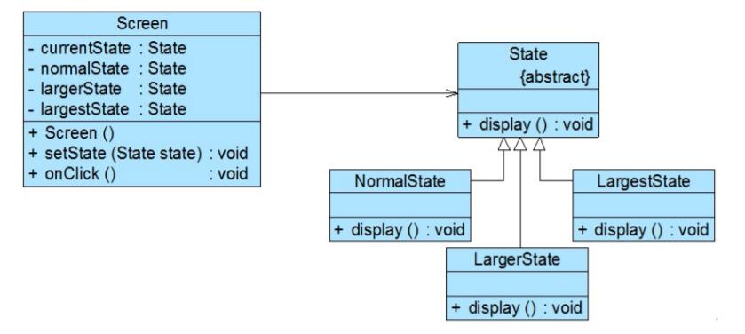

# 使用环境类实现状态转换
在之前的“银行账户状态转换”实例中，通过具体状态类来实现状态的转换，在每一个具体状态类中都包含一个stateCheck()方法，在该方法内部实现状态的转换，除此之外，还可以通过环境类来实现状态转换，环境类作为一个状态管理器，统一实现各种状态之间的转换操作。

下面通过一个包含循环状态的简单实例来说明如何使用环境类实现状态转换：

>现准备开发一个屏幕放大镜工具，其具体功能描述如下：
用户单击“放大镜”按钮之后屏幕将放大一倍，再单击一次“放大镜”按钮屏幕再放大一倍，第三次点击该按钮后屏幕将还原到默认大小。
现使用状态模式来设计该屏幕放大镜工具。


```
//屏幕类  
public class Screen {  
    //枚举所有的状态，currentState表示当前状态  
    private State currentState, normalState, largerState, largestState;  

    public Screen() {  
        this.normalState = new NormalState(); //创建正常状态对象  
        this.largerState = new LargerState(); //创建二倍放大状态对象  
        this.largestState = new LargestState(); //创建四倍放大状态对象  
        this.currentState = normalState; //设置初始状态  
        this.currentState.display();  
    }  

    public void setState(State state) {  
        this.currentState = state;  
    }  

    //单击事件处理方法，封转了对状态类中业务方法的调用和状态的转换  
    public void onClick() {  
        if (this.currentState == normalState) {  
            this.setState(largerState);  
            this.currentState.display();  
        }  
        else if (this.currentState == largerState) {  
            this.setState(largestState);  
            this.currentState.display();  
        }  
        else if (this.currentState == largestState) {  
            this.setState(normalState);  
            this.currentState.display();  
        }  
    }  
}  

//抽象状态类  
public abstract class State {  
    public abstract void display();  
}  

//正常状态类  
public class NormalState extends State{  
    public void display() {  
        System.out.println("正常大小！");  
    }  
}  

//二倍状态类  
public class LargerState extends State{  
    public void display() {  
        System.out.println("二倍大小！");  
    }  
}  

//四倍状态类  
public class LargestState extends State{  
    public void display() {  
        System.out.println("四倍大小！");  
    }  
}
```
在上述代码中，所有的状态转换操作都由环境类Screen来实现，此时，环境类充当了状态管理器角色。如果需要增加新的状态，例如“八倍状态类”，需要修改环境类，这在一定程度上违背了“开闭原则”，但对其他状态类没有任何影响。
编写如下客户端代码进行测试：
```
public class Client {  
    public static void main(String args[]) {  
        Screen screen = new Screen();  
        screen.onClick();  
        screen.onClick();  
        screen.onClick();  
    }  
}
```
输出结果如下：
```
正常大小！
二倍大小！
四倍大小！
正常大小！
```