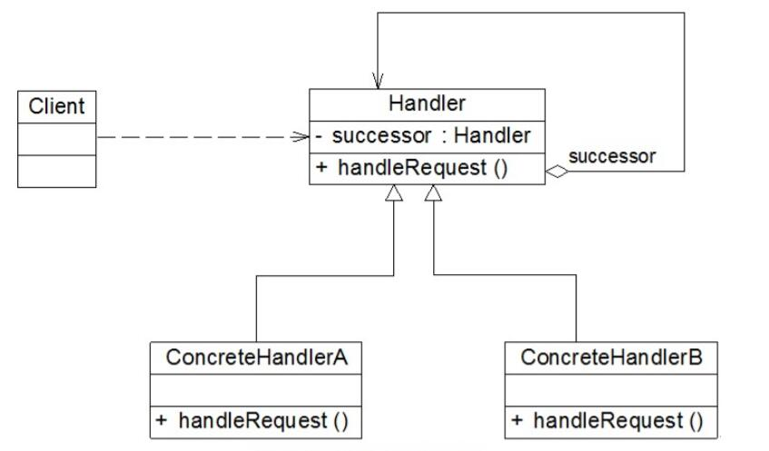

# 职责链模式结构与实现

## 职责链模式结构
  

1. Handler（抽象处理者）：它定义了一个处理请求的接口，一般设计为抽象类，由于不同的具体处理者处理请求的方式不同，因此在其中定义了抽象请求处理方法。因为每一个处理者的下家还是一个处理者，因此在抽象处理者中定义了一个抽象处理者类型的对象（如结构图中的successor），作为其对下家的引用。通过该引用，处理者可以连成一条链。
2. ConcreteHandler（具体处理者）：它是抽象处理者的子类，可以处理用户请求，在具体处理者类中实现了抽象处理者中定义的抽象请求处理方法，在处理请求之前需要进行判断，看是否有相应的处理权限，如果可以处理请求就处理它，否则将请求转发给后继者；在具体处理者中可以访问链中下一个对象，以便请求的转发。

## 职责链模式实现
在职责链模式里，很多对象由每一个对象对其下家的引用而连接起来形成一条链。请求在这个链上传递，直到链上的某一个对象决定处理此请求。发出这个请求的客户端并不知道链上的哪一个对象最终处理这个请求，这使得系统可以在不影响客户端的情况下动态地重新组织链和分配责任。

```
public abstract class Handler {  
    //维持对下家的引用  
    protected Handler successor;  

    public void setSuccessor(Handler successor) {  
        this.successor=successor;  
    }  

    public abstract void handleRequest(String request);  
}
```
具体处理者是抽象处理者的子类，它具有两大作用：第一是处理请求，不同的具体处理者以不同的形式实现抽象请求处理方法handleRequest()；第二是转发请求，如果该请求超出了当前处理者类的权限，可以将该请求转发给下家。具体处理者类的典型代码如下：
```
public class ConcreteHandler extends Handler {  
    public void handleRequest(String request) {  
        if (请求满足条件) {  
            //处理请求  
        }  
        else {  
            this.successor.handleRequest(request);  //转发请求  
        }  
    }  
}
```