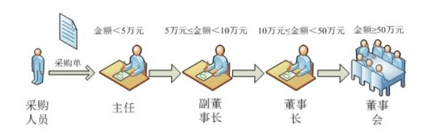
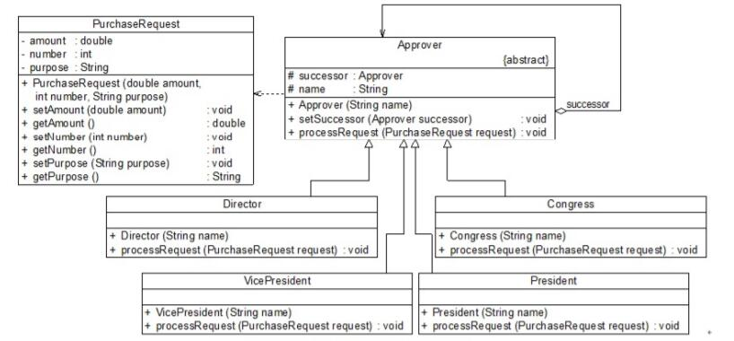

# 职责链模式应用实例
## 实例说明
> 某企业SCM(Supply Chain Management，供应链管理)系统的开发任务，其中包含一个采购审批子系统。该企业的采购审批是分级进行的，即根据采购金额的不同由不同层次的主管人员来审批，主任可以审批5万元以下（不包括5万元）的采购单，副董事长可以审批5万元至10万元（不包括10万元）的采购单，董事长可以审批10万元至50万元（不包括50万元）的采购单，50万元及以上的采购单就需要开董事会讨论决定。
>
>

## 实例类图
通过分析，可以采用一种间接访问的方式来实现该商务信息查询系统的设计，在客户端对象和信息查询对象之间增加一个代理对象，让代理对象来实现身份验证和日志记录等功能，而无须直接对原有的商务信息查询对象进行修改。



## 实例代码
```
//采购单：请求类
public class PurchaseRequest {
    private double amount; //采购金额
    private int number; //采购单编号
    private String purpose; //采购目的
    
    public PurchaseRequest(double amount, int number, String purpose) {
        this.amount = amount;
        this.number = number;
        this.purpose = purpose;
    }
    public void setAmount(double amount) {
        this.amount = amount;
    }
    public double getAmount() {
        return this.amount;
    }
    public void setNumber(int number) {
        this.number = number;
    }
    public int getNumber() {
        return this.number;
    }
    public void setPurpose(String purpose) {
        this.purpose = purpose;
    }
    public String getPurpose() {
        return this.purpose;
    }
}

//审批者类：抽象处理者
public abstract class Approver {
    protected Approver successor; //定义后继对象
    protected String name; //审批者姓名
    
    public Approver(String name) {
        this.name = name;
    }

    //设置后继者
    public void setSuccessor(Approver successor) {
        this.successor = successor;
    }

    //抽象请求处理方法
    public abstract void processRequest(PurchaseRequest request);
}

//主任类：具体处理者
public class Director extends Approver {
    public Director(String name) {
        super(name);
    }

    //具体请求处理方法
    public void processRequest(PurchaseRequest request) {
        if (request.getAmount() < 50000) {
            System.out.println("主任" + this.name + "审批采购单：" + request.getNumber() + "，金额：" + request.getAmount() + "元，采购目的：" + request.getPurpose() + "。"); //处理请求
        }
        else {
            this.successor.processRequest(request); //转发请求
        }
    }
}

//副董事长类：具体处理者
public class VicePresident extends Approver {
    public VicePresident(String name) {
        super(name);
    }

    //具体请求处理方法
    public void processRequest(PurchaseRequest request) {
        if (request.getAmount() < 100000) {
            System.out.println("副董事长" + this.name + "审批采购单：" + request.getNumber() + "，金额：" + request.getAmount() + "元，采购目的：" + request.getPurpose() + "。"); //处理请求
        }
        else {
            this.successor.processRequest(request); //转发请求
        }
    }
}

//董事长类：具体处理者
public class President extends Approver {
    public President(String name) {
        super(name);
    }
    //具体请求处理方法
    public void processRequest(PurchaseRequest request) {
        if (request.getAmount() < 500000) {
            System.out.println("董事长" + this.name + "审批采购单：" + request.getNumber() + "，金额：" + request.getAmount() + "元，采购目的：" + request.getPurpose() + "。"); //处理请求
        }
        else {
            this.successor.processRequest(request); //转发请求
        }
    }
}

//董事会类：具体处理者
public class Congress extends Approver {
    public Congress(String name) {
        super(name);
    }

    //具体请求处理方法
    public void processRequest(PurchaseRequest request) {
        System.out.println("召开董事会审批采购单：" + request.getNumber() + "，金额：" + request.getAmount() + "元，采购目的：" + request.getPurpose() + "。"); //处理请求
    }
}

//客户端测试类
public class Client {
    public static void main(String[] args) {
        Approver wjzhang,gyang,jguo,meeting;
        wjzhang = new Director("张无忌");
        gyang = new VicePresident("杨过");
        jguo = new President("郭靖");
        meeting = new Congress("董事会");
        
        //创建职责链
        wjzhang.setSuccessor(gyang);
        gyang.setSuccessor(jguo);
        jguo.setSuccessor(meeting);
        
        //创建采购单
        PurchaseRequest pr1 = new PurchaseRequest(45000,10001,"购买倚天剑");
        wjzhang.processRequest(pr1);
        PurchaseRequest pr2 = new PurchaseRequest(60000,10002,"购买《葵花宝典》");
        wjzhang.processRequest(pr2);
        PurchaseRequest pr3 = new PurchaseRequest(160000,10003,"购买《金刚经》");
        wjzhang.processRequest(pr3);
        PurchaseRequest pr4 = new PurchaseRequest(800000,10004,"购买桃花岛");
        wjzhang.processRequest(pr4);
    }
}
```
编译并运行程序，输出结果如下：
```
主任张无忌审批采购单：10001，金额：45000.0元，采购目的：购买倚天剑。
副董事长杨过审批采购单：10002，金额：60000.0元，采购目的：购买《葵花宝典》。
董事长郭靖审批采购单：10003，金额：160000.0元，采购目的：购买《金刚经》。
召开董事会审批采购单：10004，金额：800000.0元，采购目的：购买桃花岛。
```