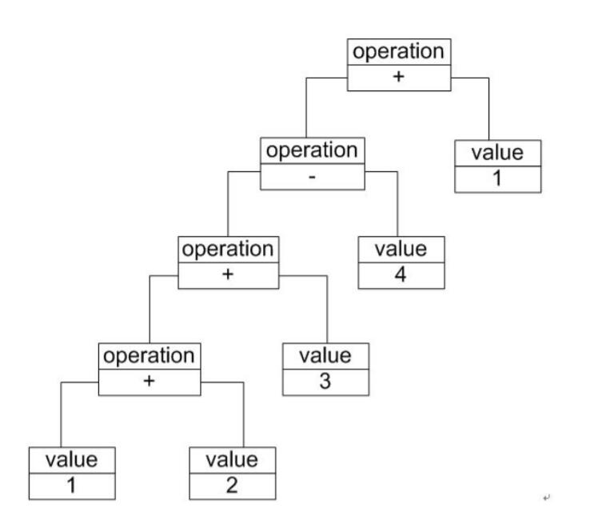

# 文法规则和抽象语法树
在一个加法/减法解释器中，每一个输入表达式（例如"1+2+3-4+1"）都包含3个语言单位，可以使用一下文法规则来定义：
```
expression ::= value | operation
operation ::= expression '+' expression | expression '-'  expression
value ::= an integer //一个整数值
```
其中，operation是**非终结符表达式**它的组成元素仍然可以是表达式，可以进一步分解；而value是**终结符表达式**，它的组成元素是最基本的语言单位，不能再进行分解。

除了使用文法规则来定义一个语言，在解释器模式中还可以通过一种称之为抽象语法树(Abstract Syntax Tree, AST)的图形方式来直观地表示语言的构成，每一棵抽象语法树对应一个语言实例。例如加法/减法表达式语言中的语句“1+ 2 + 3 – 4 + 1”，可以通过如图所示抽象语法树来表示：



在图中终结符表达式类的实例作为树的叶子节点，而非终结符表达式类的实例作为非叶子节点，它们可以将终结符表达式类的实例以及包含终结符和非终结符实例的子表达式作为其子节点。抽象语法树描述了如何构成一个复杂的句子，通过对抽象语法树的分析，可以识别出语言中的终结符类和非终结符类。