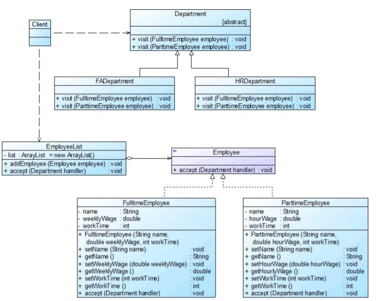

# 访问者模式应用实例
## 实例说明
>某软件公司OA系统中包含一个员工信息管理子系统，该公司员工包括正式员工和临时工，每周人力资源部和财务部等部门需要对员工数据进行汇总，汇总数据包括员工工作时间、员工工资等。该公司基本制度如下：
>
>(1) 正式员工每周工作时间为40小时，不同级别、不同部门的员工每周基本工资不同；如果超过40小时，超出部分按照100元/小时作为加班费；如果少于40小时，所缺时间按照请假处理，请假所扣工资以80元/小时计算，直到基本工资扣除到零为止。除了记录实际工作时间外，人力资源部需记录加班时长或请假时长，作为员工平时表现的一项依据。
>
>(2) 临时工每周工作时间不固定，基本工资按小时计算，不同岗位的临时工小时工资不同。人力资源部只需记录实际工作时间。
>
>人力资源部和财务部工作人员可以根据各自的需要对员工数据进行汇总处理，人力资源部负责汇总每周员工工作时间，而财务部负责计算每周员工工资。
现使用访问者模式设计该系统，绘制类图并使用Java语言编码实现。

## 实例类图


## 实例代码
```
//员工类：抽象元素类  
public interface Employee  
{  
    public void accept(Department handler); //接受一个抽象访问者访问  
}  

//全职员工类：具体元素类  
public class FulltimeEmployee implements Employee  
{  
    private String name;  
    private double weeklyWage;  
    private int workTime;  

    public FulltimeEmployee(String name,double weeklyWage,int workTime)  
    {  
        this.name = name;  
        this.weeklyWage = weeklyWage;  
        this.workTime = workTime;  
    }     

    public void setName(String name)   
    {  
        this.name = name;   
    }  

    public void setWeeklyWage(double weeklyWage)   
    {  
        this.weeklyWage = weeklyWage;   
    }  

    public void setWorkTime(int workTime)   
    {  
        this.workTime = workTime;   
    }  

    public String getName()   
    {  
        return (this.name);   
    }  

    public double getWeeklyWage()   
    {  
        return (this.weeklyWage);   
    }  

    public int getWorkTime()   
    {  
        return (this.workTime);   
    }  

    public void accept(Department handler)  
    {  
        handler.visit(this); //调用访问者的访问方法  
    }  
}  

//兼职员工类：具体元素类  
public class ParttimeEmployee implements Employee  
{  
    private String name;  
    private double hourWage;  
    private int workTime;  

    public ParttimeEmployee(String name,double hourWage,int workTime)  
    {  
        this.name = name;  
        this.hourWage = hourWage;  
        this.workTime = workTime;  
    }     

    public void setName(String name)   
    {  
        this.name = name;   
    }  

    public void setHourWage(double hourWage)   
    {  
        this.hourWage = hourWage;   
    }  

    public void setWorkTime(int workTime)   
    {  
        this.workTime = workTime;   
    }  

    public String getName()   
    {  
        return (this.name);   
    }  

    public double getHourWage()   
    {  
        return (this.hourWage);   
    }  

    public int getWorkTime()   
    {  
        return (this.workTime);   
    }  

    public void accept(Department handler)  
    {  
        handler.visit(this); //调用访问者的访问方法  
    }  
}  

//部门类：抽象访问者类  
public abstract class Department  
{  
    //声明一组重载的访问方法，用于访问不同类型的具体元素  
    public abstract void visit(FulltimeEmployee employee);  
    public abstract void visit(ParttimeEmployee employee);    
}  

//财务部类：具体访问者类  
public class FADepartment extends Department  
{  
    //实现财务部对全职员工的访问  
    public void visit(FulltimeEmployee employee)  
    {  
        int workTime = employee.getWorkTime();  
        double weekWage = employee.getWeeklyWage();  
        if(workTime > 40)  
        {  
            weekWage = weekWage + (workTime - 40) * 100;  
        }  
        else if(workTime < 40)  
        {  
            weekWage = weekWage - (40 - workTime) * 80;  
            if(weekWage < 0)  
            {  
                weekWage = 0;  
            }  
        }  
        System.out.println("正式员工" + employee.getName() + "实际工资为：" + weekWage + "元。");             
    }  

    //实现财务部对兼职员工的访问  
    public void visit(ParttimeEmployee employee)  
    {  
        int workTime = employee.getWorkTime();  
        double hourWage = employee.getHourWage();  
        System.out.println("临时工" + employee.getName() + "实际工资为：" + workTime * hourWage + "元。");       
    }         
}  

//人力资源部类：具体访问者类  
public class HRDepartment extends Department  
{  
    //实现人力资源部对全职员工的访问  
    public void visit(FulltimeEmployee employee)  
    {  
        int workTime = employee.getWorkTime();  
        System.out.println("正式员工" + employee.getName() + "实际工作时间为：" + workTime + "小时。");  
        if(workTime > 40)  
        {  
            System.out.println("正式员工" + employee.getName() + "加班时间为：" + (workTime - 40) + "小时。");  
        }  
        else if(workTime < 40)  
        {  
            System.out.println("正式员工" + employee.getName() + "请假时间为：" + (40 - workTime) + "小时。");  
        }                         
    }  

    //实现人力资源部对兼职员工的访问  
    public void visit(ParttimeEmployee employee)  
    {  
        int workTime = employee.getWorkTime();  
        System.out.println("临时工" + employee.getName() + "实际工作时间为：" + workTime + "小时。");  
    }         
}  

//员工列表类：对象结构  
public class EmployeeList  
{  
    //定义一个集合用于存储员工对象  
    private ArrayList<Employee> list = new ArrayList<Employee>();  

    public void addEmployee(Employee employee)  
    {  
        list.add(employee);  
    }  

    //遍历访问员工集合中的每一个员工对象  
    public void accept(Department handler)  
    {  
        for(Object obj : list)  
        {  
            ((Employee)obj).accept(handler);  
        }  
    }  
}

//配置文件
<?xml version="1.0"?>  
<config>  
    <className>FADepartment</className>  
</config>
```

编写如下客户端测试代码：
```
public class Client  
{  
    public static void main(String args[])  
    {  
        EmployeeList list = new EmployeeList();  
        Employee fte1,fte2,fte3,pte1,pte2;  

        fte1 = new FulltimeEmployee("张无忌",3200.00,45);  
        fte2 = new FulltimeEmployee("杨过",2000.00,40);  
        fte3 = new FulltimeEmployee("段誉",2400.00,38);  
        pte1 = new ParttimeEmployee("洪七公",80.00,20);  
        pte2 = new ParttimeEmployee("郭靖",60.00,18);  

        list.addEmployee(fte1);  
        list.addEmployee(fte2);  
        list.addEmployee(fte3);  
        list.addEmployee(pte1);  
        list.addEmployee(pte2);  

        Department dep;  
        dep = (Department)XMLUtil.getBean();  
        list.accept(dep);  
    }  
}
```
编译并运行程序，输出结果如下：
```
正式员工张无忌实际工资为：3700.0元。
正式员工杨过实际工资为：2000.0元。
正式员工段誉实际工资为：2240.0元。
临时工洪七公实际工资为：1600.0元。
临时工郭靖实际工资为：1080.0元。
```
如果要在系统中增加一种新的访问者，无须修改源代码，只要增加一个新的具体访问者类即可，在该具体访问者中封装了新的操作元素对象的方法。从增加新的访问者的角度来看，访问者模式符合**开闭原则**。

如果要在系统中增加一种新的具体元素，例如增加一种新的员工类型为“退休人员”，由于原有系统并未提供相应的访问接口（在抽象访问者中没有声明任何访问“退休人员”的方法），因此必须对原有系统进行修改，在原有的抽象访问者类和具体访问者类中增加相应的访问方法。从增加新的元素的角度来看，访问者模式违背了开闭原则。

综上所述，访问者模式与抽象工厂模式类似，对开闭原则的支持具有倾斜性，可以很方便地添加新的访问者，但是添加新的元素较为麻烦。