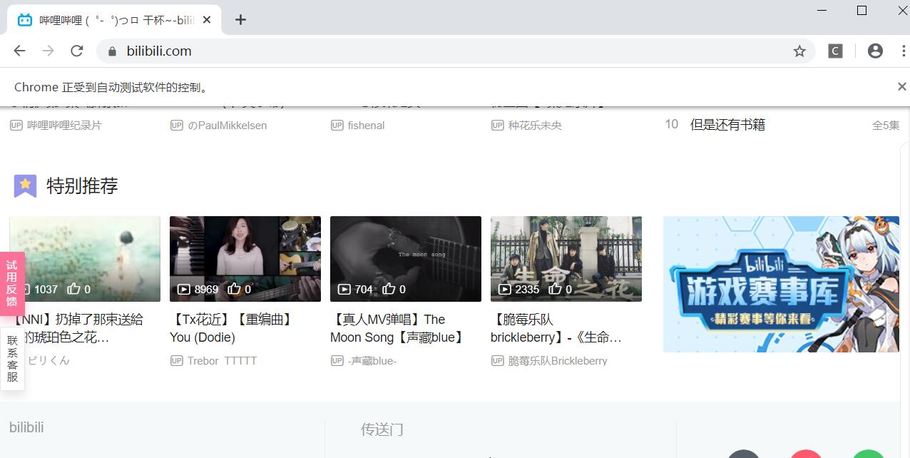

# 通过Selenium模拟浏览器抓取
第二种方法使用浏览器渲染引擎。直接用浏览器在显示网页时解析HTML，应用CSS样式并执行JavaScript的语句。

这方法在爬虫过程中会打开一个浏览器，加载该网页，自动操作浏览器浏览各个网页，顺便把数据抓下来。用一句简单而通俗的话说，使用浏览器渲染方法，爬取动态网页变成了爬取静态网页。

可以用Python的selenium库模拟浏览器完成抓取。Selenium是一个用于Web应用程序测试的工具。Selenium测试直接运行在浏览器中，浏览器自动按照脚本代码做出点击，输入，打开，验证等操作，就像真正的用户在操作一样。

```
from selenium import webdriver

driver = webdriver.Chrome(executable_path = 'E:\workspace\Jupyter Project\jupyter\chromedriver_win32\chromedriver.exe')
driver.get("http://www.bilibili.com/")
driver.execute_script("window.scrollTo(0, document.body.scrollHeight);")
```


## selenium的实战案例
使用selenium爬取bilibili视频的评论：
```
from selenium import webdriver
import time

driver = webdriver.Chrome(executable_path = 'E:\workspace\Jupyter Project\jupyter\chromedriver_win32\chromedriver.exe')
driver.get("https://www.bilibili.com/video/av75749603/?spm_id_from=333.788.videocard.0")
time.sleep(5) #等待网页加载完成
driver.execute_script("window.scrollTo(0, document.body.scrollHeight);")
time.sleep(5) #等待评论加载完成

comments = driver.find_elements_by_css_selector("div.list-item")
for i, comment in enumerate(comments):
    content = comment.find_element_by_css_selector("p.text")
    print(i, content.text)
```
**结果：**
 

selenium提供很多选择元素的方法，这里暂不介绍。

selenium提供很多操作元素的方法，常见的操作元素方法如下：
* clear 清除元素的内容
* send_keys 模拟按键输入
* click 点击元素
* submit 提交表单

例如：
```
user = driver.find_element_by_name("username")  #找到用户名输入框
user.clear  #清除用户名输入框内容
user.send_keys("1234567")  #在框中输入用户名
pwd = driver.find_element_by_name("password")  #找到密码输入框
pwd.clear  #清除密码输入框内容
pwd.send_keys("******")    #在框中输入密码
driver.find_element_by_id("loginBtn").click()  #点击登录
```