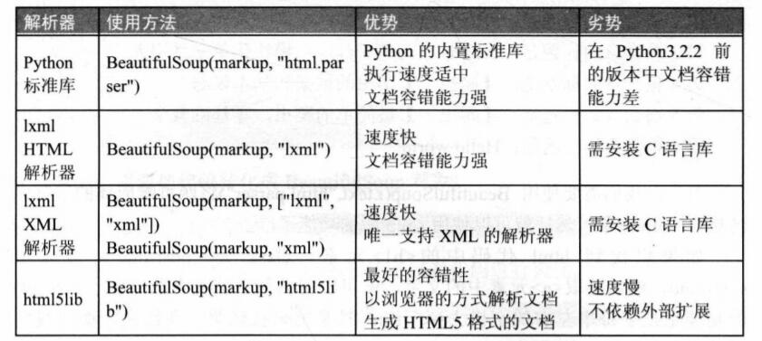

# BeautifulSoup
BeautifulSoup可以从HTML或XML文件中提取数据。


## 将HTML转化为BeautifulSoup对象
```
import requests
from bs4 import BeautifulSoup

link = "http://www.bilibili.com/"
headers = {'User-Agent' : 'Mozilla/5.0 (Windows NT 10.0; Win64; x64) AppleWebKit/537.36 (KHTML, like Gecko) Chrome/79.0.3945.117 Safari/537.36'} 
r = requests.get(link, headers= headers)

soup = BeautifulSoup(r.text,"html.parser")
```

BeautifulSoup对象是一个复杂的树形结构，它的每一个节点都是一个Python对象，获取网页内容就是一个提取对象内容的过程。提取对象的方法可以归纳为3种：
1. 遍历文档树
2. 搜索文档树
3. CSS选择树

## (1) 遍历文档树
```
html = """
<body>
    <header><h3>网页标题</h3></header>
    <content><a>超链接1</a><a>超链接2</a><a>超链接3</a></content>
    <footer><div>第一个div</div><div>第二个div</div><div>第三个div</div></footer>
</body>
"""
```
沿节点树逐级定位元素（第一个）：
```
soup = BeautifulSoup(html,"html.parser")
soup.body.div

结果：
<div>第一个div</div>
```
使用**contents**获得某个标签的所有子节点：
```
print(soup.body.content.contents)
print(soup.body.content.contents[1])

结果：
[<a>超链接1</a>, <a>超链接2</a>, <a>超链接3</a>]
<a>超链接2</a>
```
也可以使用**children**获得所有子标签：
```
for child in soup.body.content.children:
    print(child)

结果：
<a>超链接1</a>
<a>超链接2</a>
<a>超链接3</a>
```
使用**descendants**获取所有子子孙孙的节点
```
for child in soup.body.descendants:
    print(child)

结果：

<header><h3>网页标题</h3></header>
<h3>网页标题</h3>
网页标题

<content><a>超链接1</a><a>超链接2</a><a>超链接3</a></content>
<a>超链接1</a>
超链接1
<a>超链接2</a>
超链接2
<a>超链接3</a>
超链接3

<footer><div>第一个div</div><div>第二个div</div><div>第三个div</div></footer>
<div>第一个div</div>
第一个div
<div>第二个div</div>
第二个div
<div>第三个div</div>
第三个div
```
使用**parent**获取父节点
```
h3 = soup.body.header.h3
header = h3.parent

结果：
<header><h3>网页标题</h3></header>
```
## (2) 搜索文档树
**find()函数：返回第一个匹配到的对象**
| 参数 | 说明 | 使用方法 | 
| --- | --- | --- |
| name | 根据标签名称查找 | soup.find('h1') |
| kwargs | 根据标签属性查找 | soup.find(id='id1')</br>soup.find(class_='class1') |
| attrs | 根据标签属性查找 | soup.find(attrs={'id':'id2', class='class2'}) |
| text | 根据文本查找 | soup.find(text = 'gaowei') |
| | 根据正则表达式查找 | soup.find(re.compile("^h")) |

**find_all()函数：返回匹配到的所有对象**
使用方法与find()相同，额外增加了一个参数。
| 参数 | 说明 | 使用方法 | 
| --- | --- | --- |
| limit | 设置搜索数量 | soup.find_all('a', limit=2) |

## (3) CSS选择器
CSS选择器方法既可以作为遍历文档树的方法提取数据，也可以作为搜索文档树的方法提取数据。
```
html = """
<body>
    <header><h3>网页标题</h3></header>
    <content><a>超链接1</a><a>超链接2</a><a>超链接3</a></content>
    <footer><div>第一个div</div><div>第二个div</div><div>第三个div</div></footer>
</body>
"""
```
**通过标签名称查找**
```
soup = BeautifulSoup(html,"html.parser")
aList = soup.select('a')
aList

结果：
[<a>超链接1</a>, <a>超链接2</a>, <a>超链接3</a>]
```
**通过标签类名查找**
```
aList = soup.select('.class1')
```
**通过标签id查找**
```
a = soup.select('#id1')
```
**通过属性查找**
```
aList = soup.select('a[class="class1", href="http://www.bilibili.com"]')
```
**通过子标签查找**
```
aList = soup.select('content > a')
```
**通过兄弟标签查找**
```
a = soup.select('.class1 ~ a[class="class2"]')
```
**获取内容**
```
aList = soup.select('a')
for a in aList:
    print(a.text)
```