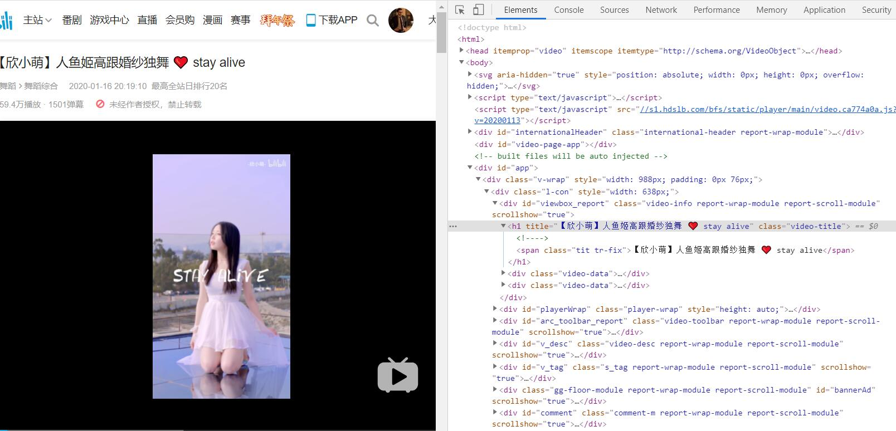
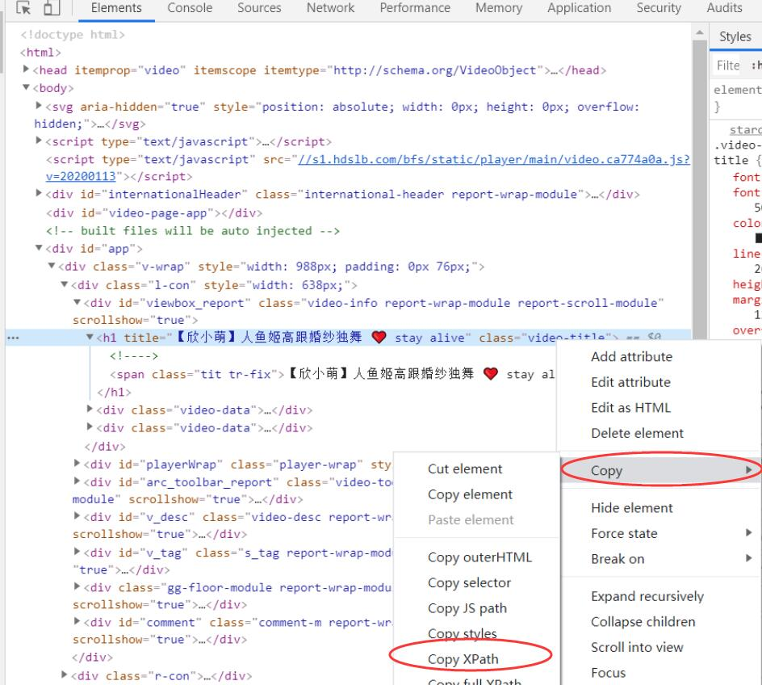

# lxml
lxml使用C语言编写，解析速度比不使用lxml解析器的BeautifulSoup快一些。

使用lxml提取网页源代码数据也有3种方法，即**XPath选择器**、**CSS选择器**和**BeautifulSoup**的find()方法。

XPath是一门在XML文档中查找信息的语言。XPath使用路径表达式来选取XML文档中的节点或节点集，也可以用在HTML获取数据中。

示例：
```
import requests
from lxml import etree

link = "https://www.bilibili.com/video/av83704889?spm_id_from=333.851.b_62696c695f7265706f72745f64616e6365.34"
headers = {'User-Agent' : 'Mozilla/5.0 (Windows NT 10.0; Win64; x64) AppleWebKit/537.36 (KHTML, like Gecko) Chrome/79.0.3945.117 Safari/537.36'} 
r = requests.get(link, headers= headers)

soup = BeautifulSoup(r.text,"html.parser")
soup.body.contents

html = etree.HTML(r.text)
title_list = html.xpath('//h1/span/text()')
print(title_list)

结果：
['【欣小萌】人鱼姬高跟婚纱独舞 ❤️ stay alive']
```

## Chrome获取元素XPath

**(1) 在Chrome浏览器中打开检查功能**

 

**(2) 找到元素，右击 -> Copy -> Copy XPath -> 粘贴**

 
```
//*[@id="viewbox_report"]/h1
```

## XPath的选取方法
XPath使用路径表达式可以在网页源代码中选取节点，它是沿着路径来选取的。

| 表达式 | 描述 |
| --- | --- |
| nodename | 选取此节点的所有子节点 |
| / | 从根节点选取 | 
| // | 从匹配选择的当前节点选择文档中的节点，而不考虑它们的位置。 | 
| . | 选取当前节点 | 
| .. | 选取当前节点的父节点 | 
| @ | 选取属性 | 