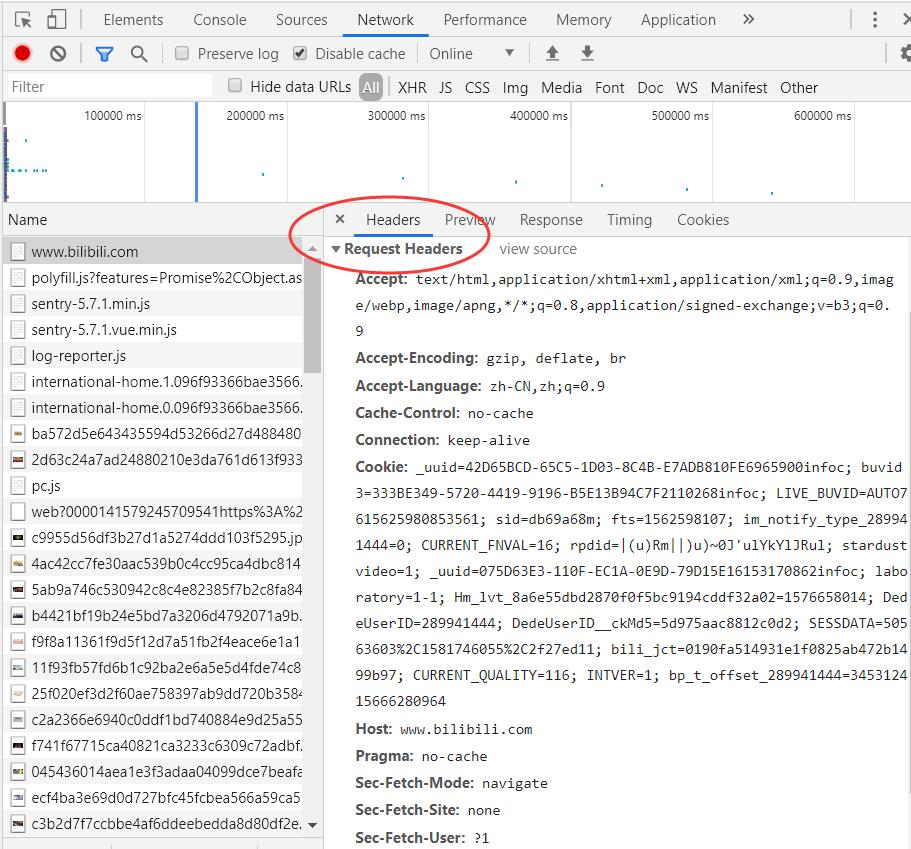

# 静态网页抓取
在网络爬虫中，静态网页的数据比较容易获取，因为所有数据都呈现在网页的HTML代码中。在静态网页抓取中，有一个强大的Requests库能够轻松地发送HTTP请求，这个库功能完善，而且操作非常简单。

## 获取响应内容
```
import requests

r = requests.get('http://www.santostang.com/')
print ("文本编码:", r.encoding)
print ("响应状态码:", r.status_code)
print ("字符串方式的响应体:", r.text)
```

## 传递URL参数
```
key_dict = {'key1': 'value1', 'key2': 'value2'}
r = requests.get('http://httpbin.org/get', params=key_dict)
```
URL已经正确编码：http://httpbin.org/get?key1=value1&key2=value2

## 定制请求头
请求头Headers提供了关于请求、响应或其他发送实体的信息。如果没有指定请求头或请求的请求头和实际网页不一致，就可能无法返回正确的结果。

可以通过Chrome浏览器的**检查**命令，查看网页的请求头。

```
headers = {
'user-agent': 'Mozilla/5.0 (Windows NT 10.0; Win64; x64) AppleWebKit/537.36 (KHTML, like Gecko) Chrome/79.0.3945.117 Safari/537.36',
'Host': 'www.bilibili.com'
}
r = requests.get('http://www.bilibili.com/', headers=headers)
```

## 发送POST请求
如果要实现POST请求，可以传递一个字典给Requests中的data参数，这个数据字典就会在发出请求的时候自动编码为表单形式。
```
import requests
key_dict = {'key1': 'value1', 'key2': 'value2'}
r = requests.post('http://httpbin.org/post', data=key_dict)
```

## 超时
有时爬虫会遇到服务器长时间不返回，这时爬虫程序就会一直等待，造成爬虫程序没有顺利地执行。因此，可以用Requests在timeout参数设定的秒数结束之后停止等待响应。如果服务器在timeout秒内没有应答，就返回异常。
```
r = requests.get('http://www.bilibili.com/', timeout=20)
```

