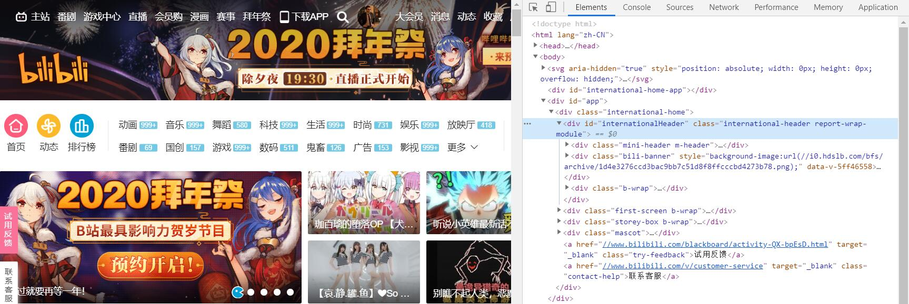
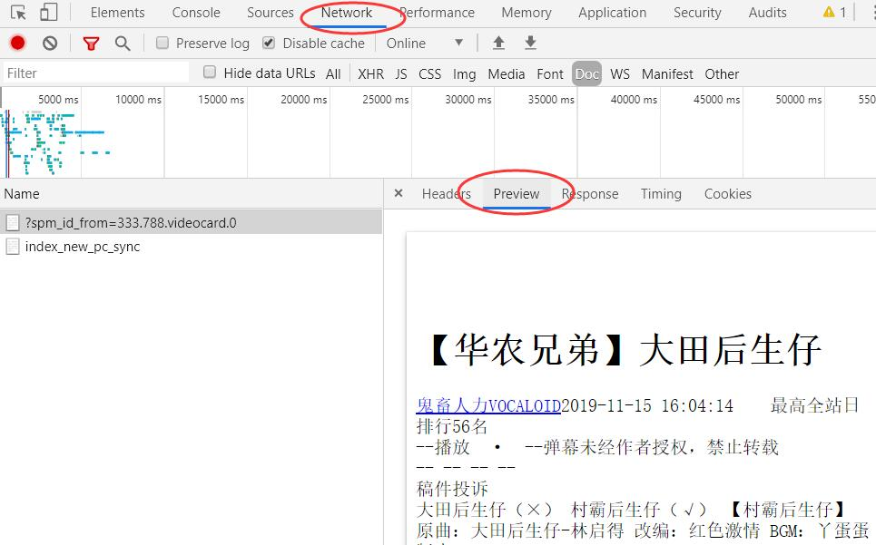

# 解析真实地址抓取
虽然数据并没有出现在网页源代码中，也可以找到数据的真实地址，请求这个真实地址也可以获得想要的数据。这里用到浏览器的“检查”功能。

## 打开检查功能
用Chrome浏览器打开网页，右键页面任意位置，在弹出的对话框中，点击“检查”选项。得到如下图所示的对话框。

 

## 找到真实的数据地址
点击对话框中的Network，然后刷新网页。此时，Network 会显示浏览器从网页服务器中得到的所有文件，一般这个过程称之为“抓包”。



## 爬取真实数据地址
找到了真实的地址，就可以直接用requests请求这个地址获取数据。
```
import requests
link = """https://www.bilibili.com/video/av75749603/?spm_id_from=333.788.videocard.0"""
headers = {'User-Agent': 'Mozilla/5.0 (Windows NT 10.0; Win64; x64) AppleWebKit/537.36 (KHTML, like Gecko) Chrome/79.0.3945.117 Safari/537.36'}
r = requests.get(link, headers= headers)
print (r.text)
```

## 解析数据
根据返回数据的不同格式使用相应的方式对其进行解析即可。例如：返回类型为Json格式的数据，可以使用json库进行解析。